# Dikho Visual System Handbook

Last verified against the repository: 2026-10-05

This is the visual entry point for the entire project. It explains what Dikho
does, who uses it, how requests and data move, where security boundaries sit,
what is already implemented, and how the current internal product can evolve
into a configurable public release.

**Ownership boundary:** the current system and repository are proprietary
property of Dikho Global Media LLP. Every public-release diagram in this
handbook is target-state planning, not evidence of publication, licensing or
permission to redistribute the current software.

Use this file for orientation. Use the linked specialist documents for exact
implementation and operational rules:

- [Product direction](docs/PRODUCT.md)
- [System invariants](docs/INVARIANTS.md)
- [Technical architecture](docs/ARCHITECTURE.md)
- [Database and Storage](docs/DATABASE.md)
- [Permissions and roles](docs/PERMISSIONS.md)
- [Configuration reference](docs/CONFIGURATION.md)
- [Branding and organization identity](docs/BRANDING.md)
- [Security audit](docs/SECURITY-AUDIT.md)
- [Engineering roadmap](docs/ROADMAP.md)
- [Testing guide](docs/TESTING.md)
- [Deployment guide](docs/DEPLOYMENT.md)
- [Upgrade guide](docs/UPGRADING.md)

## Reading legend

| Marker | Meaning |
| --- | --- |
| **Current** | Implemented in this repository now |
| **Target** | Intended future design, not yet a promise of implementation |
| **Gap** | Known incomplete or unsafe boundary tracked for remediation |
| **Synthetic screenshot** | Real UI rendered locally with invented data |
| Solid arrow | Synchronous request or direct dependency |
| Dashed arrow | Asynchronous callback, webhook, queue or future path |

Diagrams intentionally show logical names rather than production identifiers.
No credential values, private resource IDs, live user records or signed URLs
belong in this file.

---

## 1. Product north star

### Two product horizons

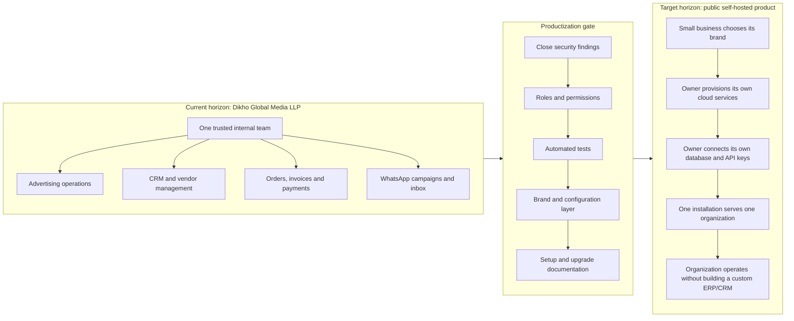
```mermaid
flowchart LR
    subgraph NOW[Current horizon: Dikho Global Media LLP]
        N1[One trusted internal team]
        N2[Advertising operations]
        N3[CRM and vendor management]
        N4[Orders, invoices and payments]
        N5[WhatsApp campaigns and inbox]
        N1 --> N2
        N1 --> N3
        N1 --> N4
        N1 --> N5
    end

    subgraph HARDEN[Productization gate]
        H1[Close security findings]
        H2[Roles and permissions]
        H3[Automated tests]
        H4[Brand and configuration layer]
        H5[Setup and upgrade documentation]
        H1 --> H2 --> H3 --> H4 --> H5
    end

    subgraph FUTURE[Target horizon: public self-hosted product]
        F1[Small business chooses its brand]
        F2[Owner provisions its own cloud services]
        F3[Owner connects its own database and API keys]
        F4[One installation serves one organization]
        F5[Organization operates without building a custom ERP/CRM]
        F1 --> F2 --> F3 --> F4 --> F5
    end

    NOW --> HARDEN --> FUTURE
```

The safest initial public model is **one self-hosted installation per
organization**, with explicit configuration and branding. That gives small
businesses ownership of their data and provider accounts without requiring a
shared multi-tenant SaaS control plane. A future shared-hosting model would need
separate design work for tenant isolation, billing, support access and upgrades.

### Value delivered

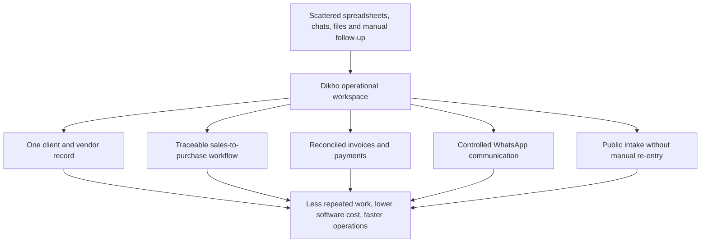
```mermaid
flowchart TB
    INPUTS[Scattered spreadsheets, chats, files and manual follow-up]
    HUB[Dikho operational workspace]
    O1[One client and vendor record]
    O2[Traceable sales-to-purchase workflow]
    O3[Reconciled invoices and payments]
    O4[Controlled WhatsApp communication]
    O5[Public intake without manual re-entry]
    OUTCOME[Less repeated work, lower software cost, faster operations]

    INPUTS --> HUB
    HUB --> O1
    HUB --> O2
    HUB --> O3
    HUB --> O4
    HUB --> O5
    O1 --> OUTCOME
    O2 --> OUTCOME
    O3 --> OUTCOME
    O4 --> OUTCOME
    O5 --> OUTCOME
```

### Conceptual 3D view

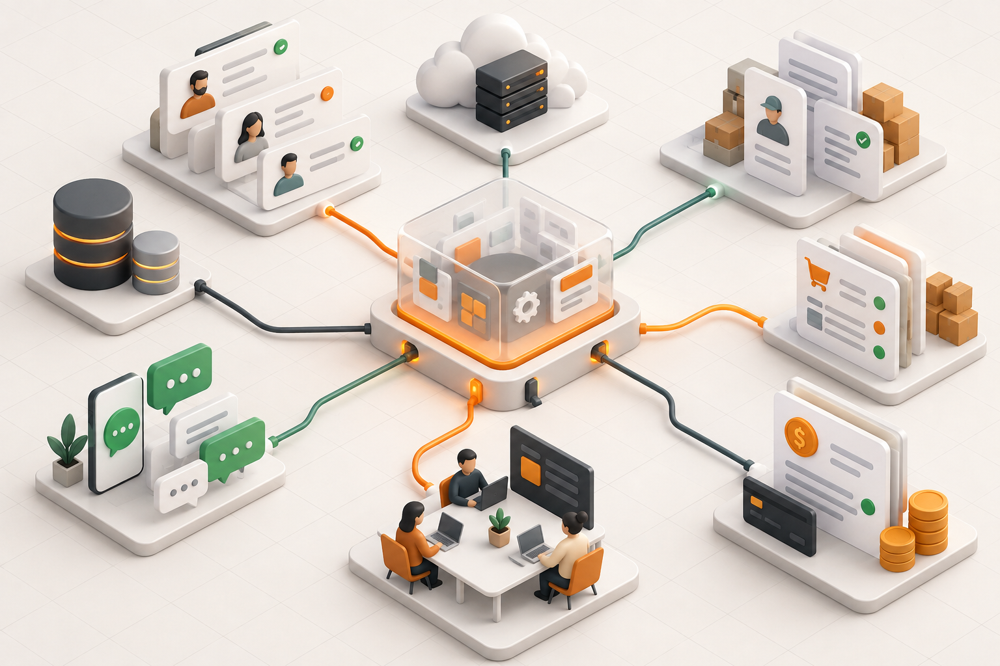

This generated illustration is conceptual, not a deployment diagram. The
central workspace connects the seven capability groups shown below. Exact
runtime and data relationships are defined by the deterministic diagrams later
in this document.

```text
Top left      CRM: clients, leads and contacts
Top center    Cloud services and server runtimes
Top right     Vendors, onboarding and documents
Middle right  Sales, purchase and fulfilment operations
Bottom right  Finance, invoices and payments
Bottom center Internal operators and approvals
Bottom left   WhatsApp communication
Middle left   Business databases and storage
```

---

## 2. Capability map


```mermaid
flowchart TB
    DIKHO[Dikho]

    DIKHO --> CRM[CRM and intake]
    CRM --> CLIENTS[Clients]
    CRM --> LEADS[Corporate-gifting leads]
    CRM --> VENDORS[Vendors and addresses]
    CRM --> PUBLIC[Public registration forms]

    DIKHO --> OPS[Advertising operations]
    OPS --> SO[Sales orders]
    OPS --> PO[Purchase orders]
    OPS --> MEDIA[Media and sub-media catalog]
    OPS --> DOCS[Business documents]

    DIKHO --> FIN[Finance]
    FIN --> INV[Invoices and invoice lines]
    FIN --> PAY[Payments and allocations]
    FIN --> RECEIPTS[Receipts and payment requests]
    FIN --> AUDIT[Document events]

    DIKHO --> WA[WhatsApp]
    WA --> CONTACTS[Opted-in contacts]
    WA --> TEMPLATES[Approved templates]
    WA --> CAMPAIGNS[Campaigns and retries]
    WA --> INBOX[Two-way inbox]
    WA --> STATUS[Delivery receipts]
    WA --> WAMEDIA[Protected media]

    DIKHO --> PLATFORM[Platform]
    PLATFORM --> AUTH[Email and WhatsApp OTP]
    PLATFORM --> DEVICE[Login/device audit]
    PLATFORM --> THEMES[Light, dark and system theme]
    PLATFORM --> CONFIG[Cloud/provider configuration]
```

### Current product surfaces

| Surface | Route | Audience | State |
| --- | --- | --- | --- |
| Login | `/` when signed out | Invited staff | Current |
| Clients | `/clients` | Authenticated staff | Current |
| Leads | `/leads` | Authenticated staff | Current |
| Vendors | `/vendors` | Authenticated staff | Current |
| Sales orders | `/sales-orders` | Authenticated staff | Current |
| Purchase orders | `/purchase-orders` | Authenticated staff | Current |
| WhatsApp overview | `/whatsapp` | Authenticated staff | Current |
| WhatsApp inbox | `/whatsapp/inbox` | Authenticated staff | Current |
| WhatsApp contacts | `/whatsapp/contacts` | Authenticated staff | Current |
| WhatsApp campaigns | `/whatsapp/campaigns` | Authenticated staff | Current |
| WhatsApp templates | `/whatsapp/templates` | Authenticated staff | Current |
| Settings | `/settings` | Authenticated staff | Current |
| Vendor registration | `/vendor/register` | Public vendors | Current, upload gap |
| Corporate gifting | `/corporategifting` | Public prospects | Current |
| Dashboard | `/dashboard` | Authenticated staff | Placeholder |
| Invoice notification | `/invoices` | Authenticated staff | Placeholder route |
| Advance payment receipt | `/advance-payments` | Authenticated staff | Placeholder route |
| Payment receipt | `/payment-receipts` | Authenticated staff | Placeholder route |
| Payment request | `/payment-requests` | Authenticated staff | Placeholder route |
| Document courier | `/courier` | Authenticated staff | Placeholder route |

Placeholder routes communicate intended navigation, not completed workflows.

---

## 3. Users and interactions

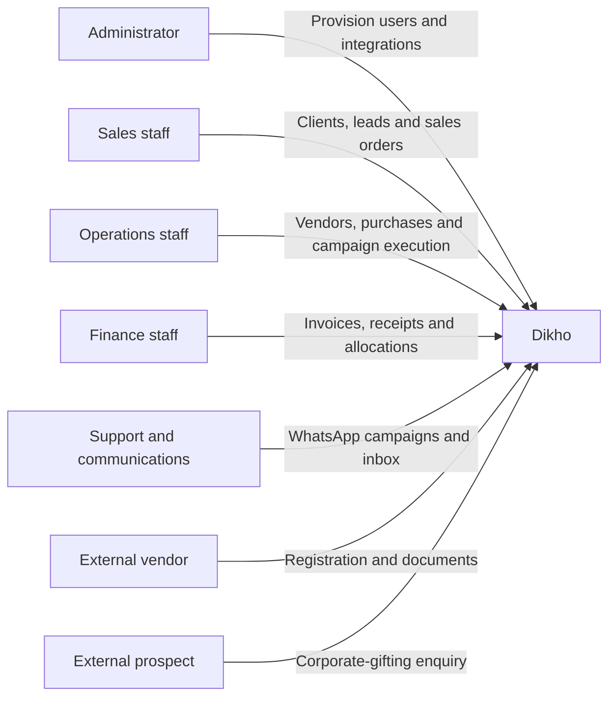
```mermaid
flowchart LR
    ADMIN[Administrator]
    SALES[Sales staff]
    OPS[Operations staff]
    FINANCE[Finance staff]
    SUPPORT[Support and communications]
    VENDOR[External vendor]
    PROSPECT[External prospect]

    ADMIN -->|Provision users and integrations| SYSTEM[Dikho]
    SALES -->|Clients, leads and sales orders| SYSTEM
    OPS -->|Vendors, purchases and campaign execution| SYSTEM
    FINANCE -->|Invoices, receipts and allocations| SYSTEM
    SUPPORT -->|WhatsApp campaigns and inbox| SYSTEM
    VENDOR -->|Registration and documents| SYSTEM
    PROSPECT -->|Corporate-gifting enquiry| SYSTEM
```

**Current authorization reality:** all provisioned internal accounts are
treated as one trusted team across many API and database paths. The role names
above describe business responsibilities; they are not yet a fully enforced
permission model.

**Target authorization:** `admin`, `sales`, `operations`, `finance` and
`support` permissions are explicitly mapped to routes, rows and object actions.

---

## 4. Real UI screenshots

The screenshots below were rendered from this codebase in October 2026. Sign-in
and corporate gifting were captured from the app's own routes on a local dev
server. The other four come from the preview harnesses in `scripts/preview/`,
which render the real page components against synthetic data and never submit;
regenerate them from those harnesses after UI changes. No live session,
production database row, credential, message body or uploaded document was
captured.

### Staff sign-in

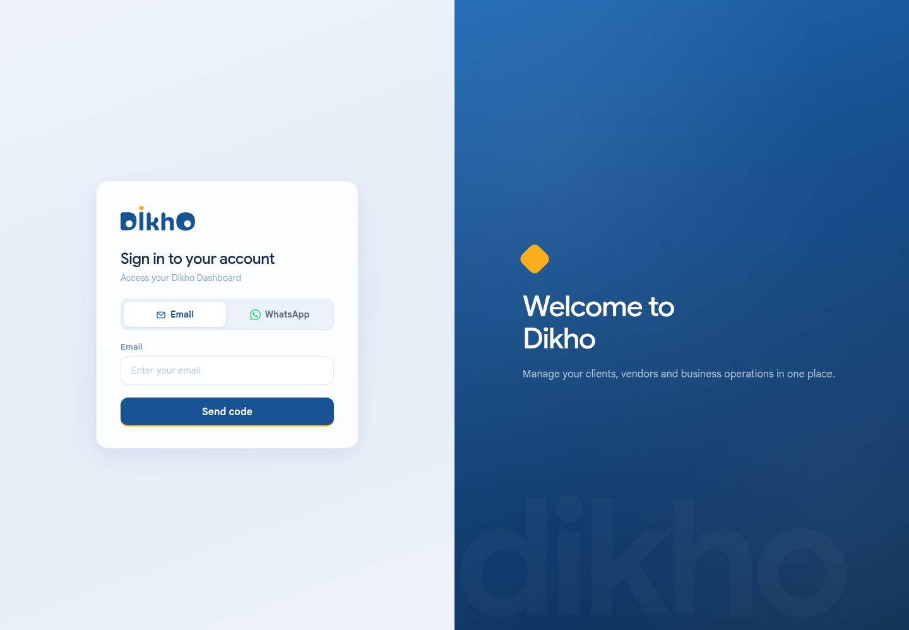

The same invite-only account can authenticate by email OTP or WhatsApp-delivered
OTP. Supabase issues the session in both cases.

### Public vendor registration

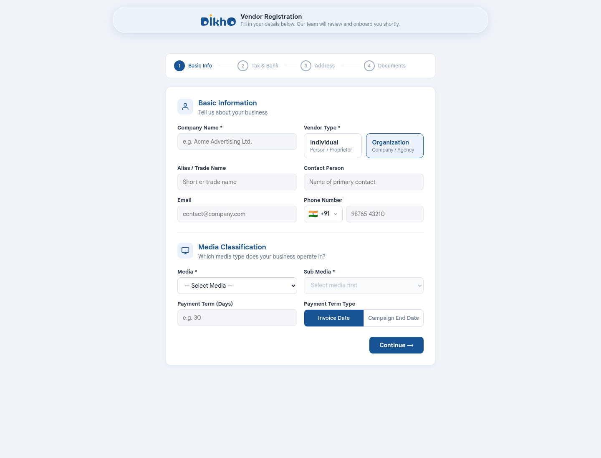

This is the first of four steps: basic information, tax/bank information,
address and documents. The current document step is a known security gap because
the browser can upload directly under an anonymous Storage policy.

### Public corporate-gifting intake

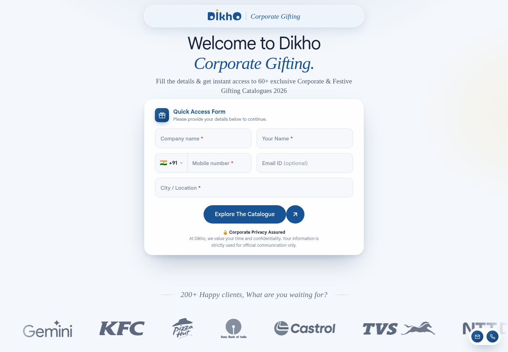

This public surface records a lead and can schedule a budget-controlled WhatsApp
confirmation after the server verifies Turnstile.

### Vendor operations

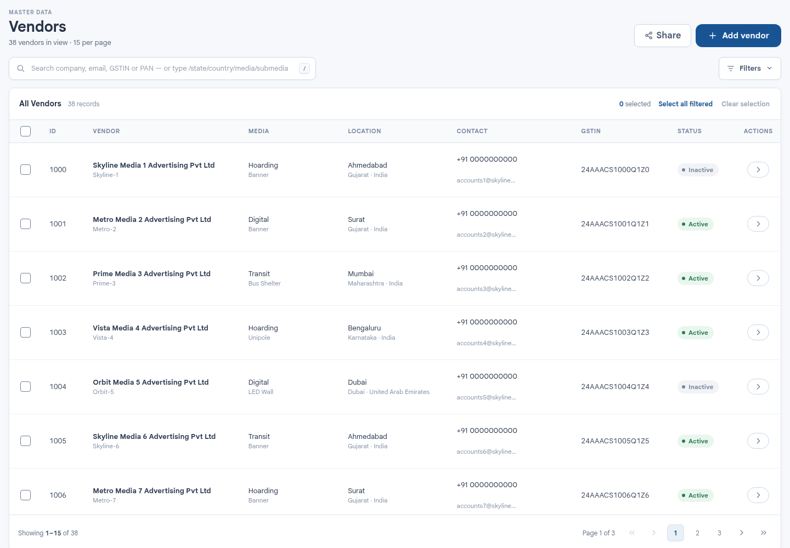

The synthetic preview demonstrates search, structured filtering, pagination,
status, contact actions and vendor detail navigation.

### Sales orders

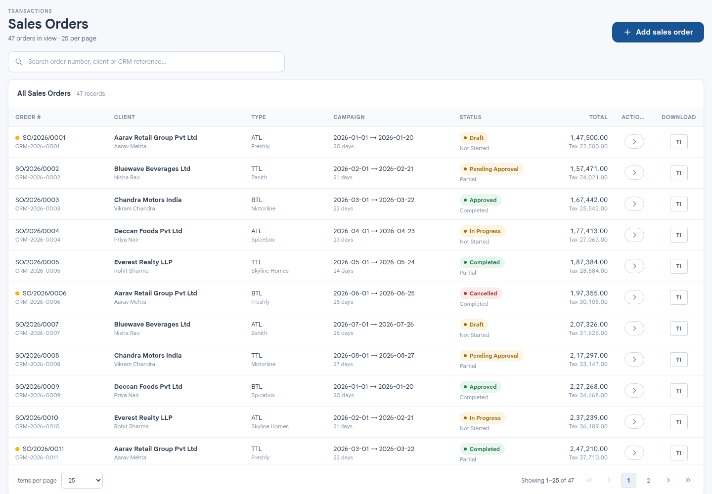

The list connects client, campaign period, operational status, purchase status,
tax totals and generated-document actions.

### WhatsApp performance

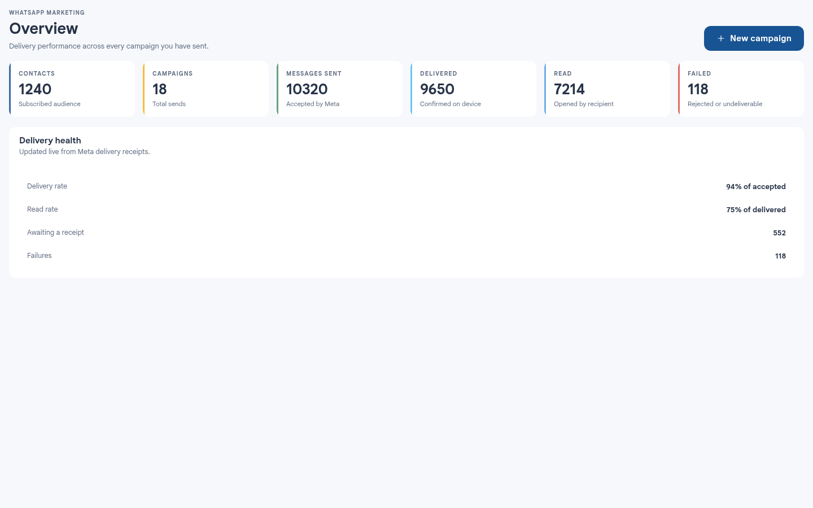

Delivery is measured against messages accepted by Meta; read rate is measured
against messages delivered to a device. The screenshot contains synthetic
aggregate values and no contacts or message content.

---

## 5. Core business workflows

### Lead to cash

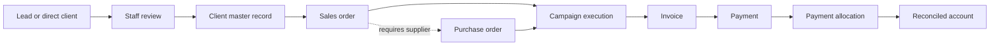
```mermaid
flowchart LR
    LEAD[Lead or direct client]
    REVIEW[Staff review]
    CLIENT[Client master record]
    SO[Sales order]
    EXEC[Campaign execution]
    INV[Invoice]
    PAYMENT[Payment]
    ALLOC[Payment allocation]
    CLOSED[Reconciled account]

    LEAD --> REVIEW --> CLIENT --> SO --> EXEC --> INV --> PAYMENT --> ALLOC --> CLOSED
    SO -. requires supplier .-> PO[Purchase order]
    PO --> EXEC
```

Financial invariants:

```text
line total       = taxable amount + line tax
line tax         = CGST + SGST + IGST + UTGST
order subtotal   = sum(line taxable amount)
order tax total  = sum(line tax)
order grand total= subtotal + tax total
allocation       <= unallocated payment and unpaid invoice balance
```

### Vendor onboarding

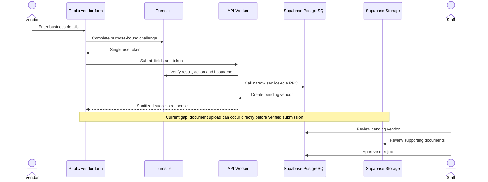
```mermaid
sequenceDiagram
    actor Vendor
    participant Form as Public vendor form
    participant Verify as Turnstile
    participant API as API Worker
    participant DB as Supabase PostgreSQL
    participant Files as Supabase Storage
    actor Staff

    Vendor->>Form: Enter business details
    Form->>Verify: Complete purpose-bound challenge
    Verify-->>Form: Single-use token
    Form->>API: Submit fields and token
    API->>Verify: Verify result, action and hostname
    API->>DB: Call narrow service-role RPC
    DB-->>API: Create pending vendor
    API-->>Form: Sanitized success response
    Note over Form,Files: Current gap: document upload can occur directly before verified submission
    Staff->>DB: Review pending vendor
    Staff->>Files: Review supporting documents
    Staff->>DB: Approve or reject
```

Target document path:

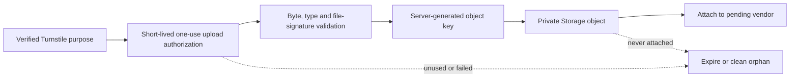
```mermaid
flowchart LR
    CHALLENGE[Verified Turnstile purpose]
    TICKET[Short-lived one-use upload authorization]
    LIMITS[Byte, type and file-signature validation]
    KEY[Server-generated object key]
    PRIVATE[Private Storage object]
    LINK[Attach to pending vendor]
    CLEANUP[Expire or clean orphan]

    CHALLENGE --> TICKET --> LIMITS --> KEY --> PRIVATE --> LINK
    TICKET -. unused or failed .-> CLEANUP
    PRIVATE -. never attached .-> CLEANUP
```

### Corporate-gifting lead intake

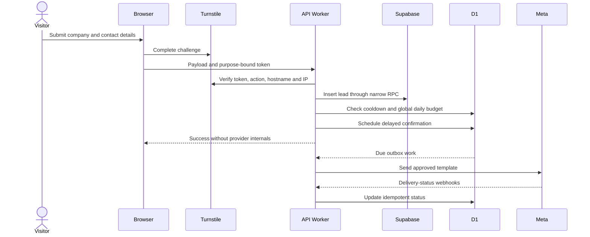
```mermaid
sequenceDiagram
    actor Visitor
    participant Browser
    participant Turnstile
    participant API as API Worker
    participant PG as Supabase
    participant D1
    participant Meta

    Visitor->>Browser: Submit company and contact details
    Browser->>Turnstile: Complete challenge
    Browser->>API: Payload and purpose-bound token
    API->>Turnstile: Verify token, action, hostname and IP
    API->>PG: Insert lead through narrow RPC
    API->>D1: Check cooldown and global daily budget
    API->>D1: Schedule delayed confirmation
    API-->>Browser: Success without provider internals
    D1-->>API: Due outbox work
    API->>Meta: Send approved template
    Meta-->>API: Delivery-status webhooks
    API->>D1: Update idempotent status
```

### Sales and purchasing relationship

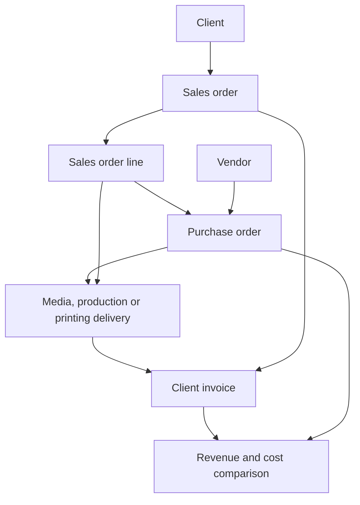
```mermaid
flowchart TB
    CLIENT[Client]
    SO[Sales order]
    SOL[Sales order line]
    VENDOR[Vendor]
    PO[Purchase order]
    SERVICE[Media, production or printing delivery]
    INVOICE[Client invoice]
    PROFIT[Revenue and cost comparison]

    CLIENT --> SO
    SO --> SOL
    SOL --> PO
    VENDOR --> PO
    PO --> SERVICE
    SOL --> SERVICE
    SERVICE --> INVOICE
    SO --> INVOICE
    INVOICE --> PROFIT
    PO --> PROFIT
```

### Email OTP sign-in

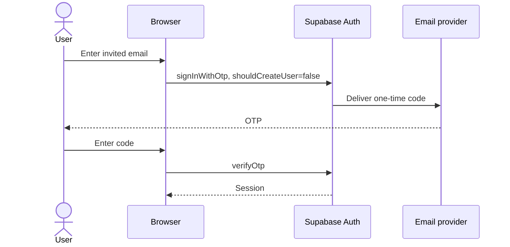
```mermaid
sequenceDiagram
    actor User
    participant Browser
    participant Auth as Supabase Auth
    participant Mail as Email provider

    User->>Browser: Enter invited email
    Browser->>Auth: signInWithOtp, shouldCreateUser=false
    Auth->>Mail: Deliver one-time code
    Mail-->>User: OTP
    User->>Browser: Enter code
    Browser->>Auth: verifyOtp
    Auth-->>Browser: Session
```

### WhatsApp OTP sign-in

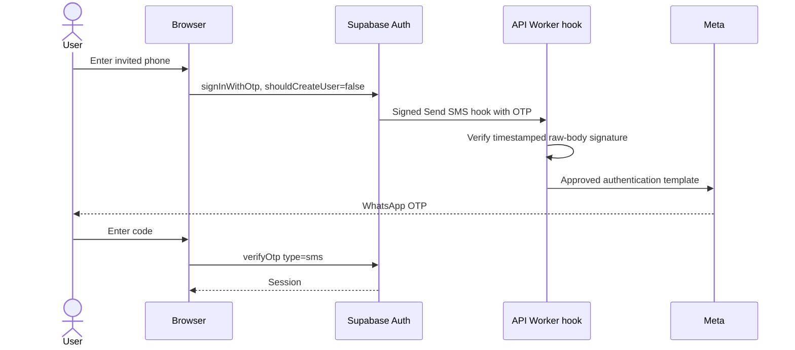
```mermaid
sequenceDiagram
    actor User
    participant Browser
    participant Auth as Supabase Auth
    participant Hook as API Worker hook
    participant Meta

    User->>Browser: Enter invited phone
    Browser->>Auth: signInWithOtp, shouldCreateUser=false
    Auth->>Hook: Signed Send SMS hook with OTP
    Hook->>Hook: Verify timestamped raw-body signature
    Hook->>Meta: Approved authentication template
    Meta-->>User: WhatsApp OTP
    User->>Browser: Enter code
    Browser->>Auth: verifyOtp type=sms
    Auth-->>Browser: Session
```

### WhatsApp campaign

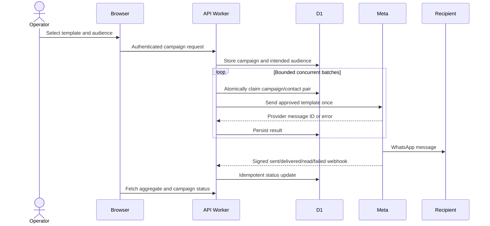
```mermaid
sequenceDiagram
    actor Operator
    participant Browser
    participant API as API Worker
    participant D1
    participant Meta
    participant Recipient

    Operator->>Browser: Select template and audience
    Browser->>API: Authenticated campaign request
    API->>D1: Store campaign and intended audience
    loop Bounded concurrent batches
        API->>D1: Atomically claim campaign/contact pair
        API->>Meta: Send approved template once
        Meta-->>API: Provider message ID or error
        API->>D1: Persist result
    end
    Meta->>Recipient: WhatsApp message
    Meta-->>API: Signed sent/delivered/read/failed webhook
    API->>D1: Idempotent status update
    Browser->>API: Fetch aggregate and campaign status
```

### Two-way inbox and media

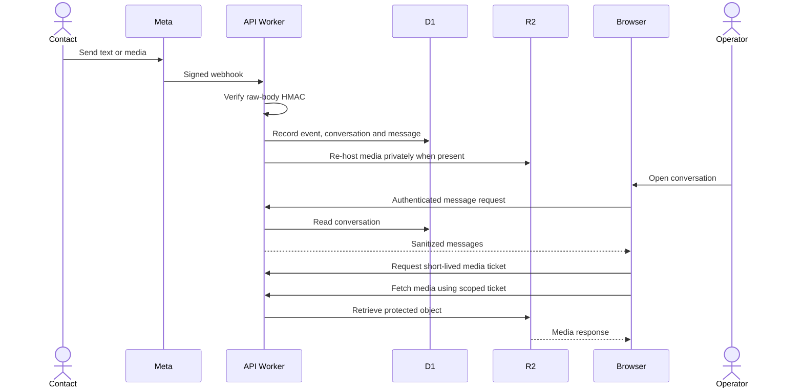
```mermaid
sequenceDiagram
    actor Contact
    participant Meta
    participant API as API Worker
    participant D1
    participant R2
    participant Browser
    actor Operator

    Contact->>Meta: Send text or media
    Meta->>API: Signed webhook
    API->>API: Verify raw-body HMAC
    API->>D1: Record event, conversation and message
    API->>R2: Re-host media privately when present
    Operator->>Browser: Open conversation
    Browser->>API: Authenticated message request
    API->>D1: Read conversation
    API-->>Browser: Sanitized messages
    Browser->>API: Request short-lived media ticket
    Browser->>API: Fetch media using scoped ticket
    API->>R2: Retrieve protected object
    R2-->>Browser: Media response
```

---

## 6. Runtime architecture

### System context

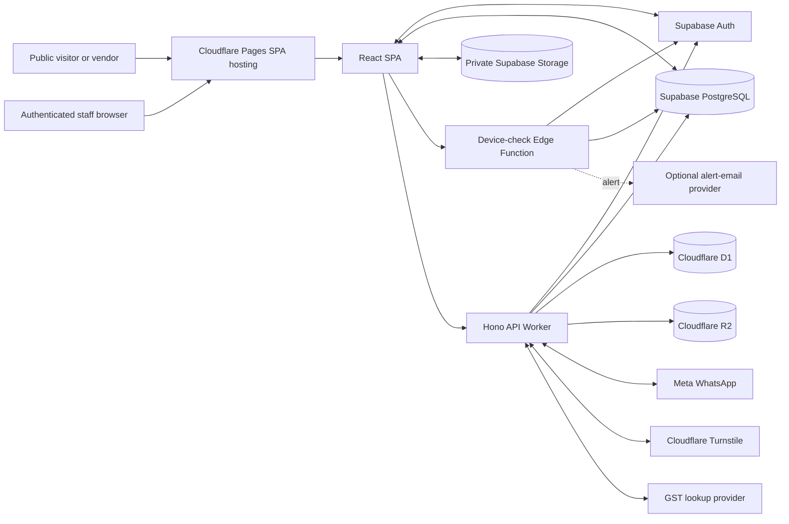
```mermaid
flowchart LR
    PUBLIC[Public visitor or vendor]
    STAFF[Authenticated staff browser]
    SPA[React SPA]
    SPAW[Cloudflare Pages SPA hosting]
    API[Hono API Worker]
    AUTH[Supabase Auth]
    PG[(Supabase PostgreSQL)]
    SST[(Private Supabase Storage)]
    EDGE[Device-check Edge Function]
    D1[(Cloudflare D1)]
    R2[(Cloudflare R2)]
    META[Meta WhatsApp]
    TURN[Cloudflare Turnstile]
    GST[GST lookup provider]
    MAIL[Optional alert-email provider]

    PUBLIC --> SPAW --> SPA
    STAFF --> SPAW
    SPA <--> AUTH
    SPA <--> PG
    SPA <--> SST
    SPA --> EDGE
    SPA --> API
    API --> AUTH
    API --> PG
    API --> D1
    API --> R2
    API <--> META
    API <--> TURN
    API <--> GST
    EDGE --> AUTH
    EDGE --> PG
    EDGE -. alert .-> MAIL
```

### Deployment topology

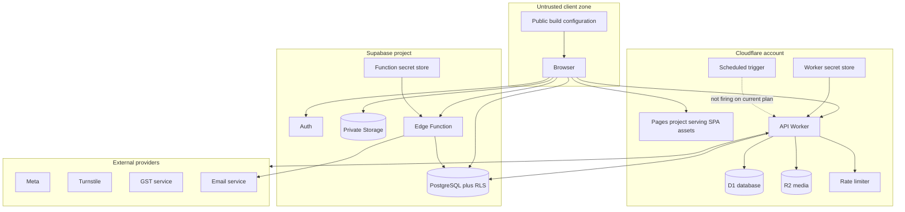
```mermaid
flowchart TB
    subgraph CLIENT[Untrusted client zone]
        BROWSER[Browser]
        PUBLIC_CONFIG[Public build configuration]
    end

    subgraph CF[Cloudflare account]
        SPAW[Pages project serving SPA assets]
        APIW[API Worker]
        D1[(D1 database)]
        R2[(R2 media)]
        RL[Rate limiter]
        SECRETS[Worker secret store]
        CRON[Scheduled trigger]
    end

    subgraph SB[Supabase project]
        AUTH[Auth]
        PG[(PostgreSQL plus RLS)]
        STORAGE[(Private Storage)]
        FUNC[Edge Function]
        SBSECRETS[Function secret store]
    end

    subgraph PROVIDERS[External providers]
        META[Meta]
        TURN[Turnstile]
        GST[GST service]
        EMAIL[Email service]
    end

    BROWSER --> SPAW
    PUBLIC_CONFIG --> BROWSER
    BROWSER --> AUTH
    BROWSER --> PG
    BROWSER --> STORAGE
    BROWSER --> FUNC
    BROWSER --> APIW
    APIW --> D1
    APIW --> R2
    APIW --> RL
    SECRETS --> APIW
    CRON -. not firing on current plan .-> APIW
    APIW <--> PROVIDERS
    APIW --> PG
    SBSECRETS --> FUNC
    FUNC --> PG
    FUNC --> EMAIL
```

### What may exist in each zone

| Zone | May contain | Must not contain |
| --- | --- | --- |
| Browser bundle | UI code, public Supabase URL/key, API origin, public site key | Service-role keys, provider secrets, signing keys |
| API Worker | Server logic, D1/R2 bindings, secret references | Secret values in logs or responses |
| Supabase | Business rows, RLS, private documents, auth identities | Broad anonymous mutation |
| D1/R2 | Messaging state and protected media | Direct browser SQL or unrestricted object access |
| Documentation | Names, responsibilities, placeholders and procedures | Credential values, OTPs, signed URLs, private IDs, production data |

### Request classification

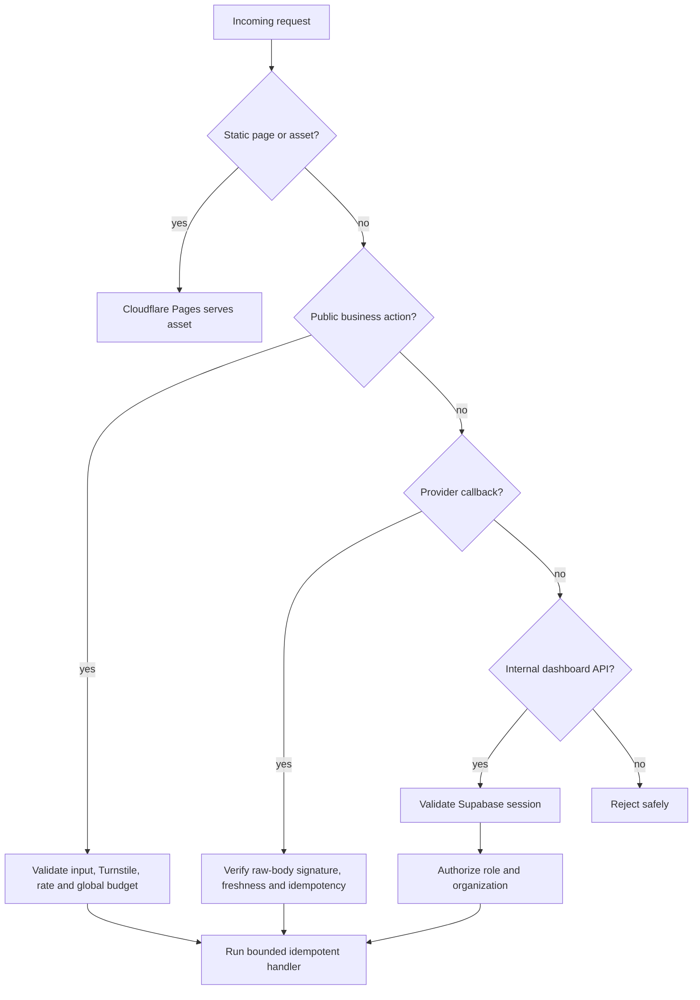
```mermaid
flowchart TD
    REQUEST[Incoming request]
    Q1{Static page or asset?}
    Q2{Public business action?}
    Q3{Provider callback?}
    Q4{Internal dashboard API?}
    STATIC[Cloudflare Pages serves asset]
    PUBLIC[Validate input, Turnstile, rate and global budget]
    HOOK[Verify raw-body signature, freshness and idempotency]
    AUTH[Validate Supabase session]
    ROLE[Authorize role and organization]
    REJECT[Reject safely]
    HANDLE[Run bounded idempotent handler]

    REQUEST --> Q1
    Q1 -->|yes| STATIC
    Q1 -->|no| Q2
    Q2 -->|yes| PUBLIC --> HANDLE
    Q2 -->|no| Q3
    Q3 -->|yes| HOOK --> HANDLE
    Q3 -->|no| Q4
    Q4 -->|yes| AUTH --> ROLE --> HANDLE
    Q4 -->|no| REJECT
```

The `ROLE` step is the target model. Many current protected routes stop after
validating the session, which is acceptable only for the present trusted-team
deployment.

### Direct browser access versus API access

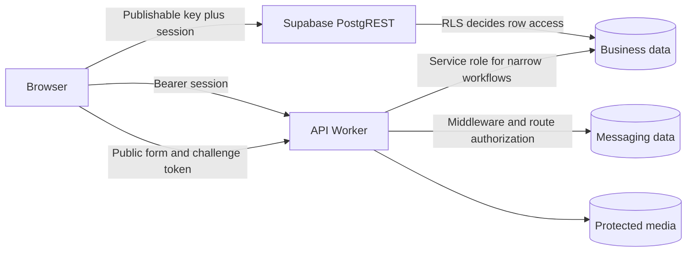
```mermaid
flowchart LR
    B[Browser]

    B -->|Publishable key plus session| PGR[Supabase PostgREST]
    PGR -->|RLS decides row access| PG[(Business data)]

    B -->|Bearer session| API[API Worker]
    API -->|Middleware and route authorization| D1[(Messaging data)]
    API --> R2[(Protected media)]
    API -->|Service role for narrow workflows| PG

    B -->|Public form and challenge token| API
```

RLS is load-bearing wherever the browser talks directly to Supabase. API
middleware is load-bearing for D1, R2 and privileged Supabase calls.

---

## 7. Data architecture

### Data ownership

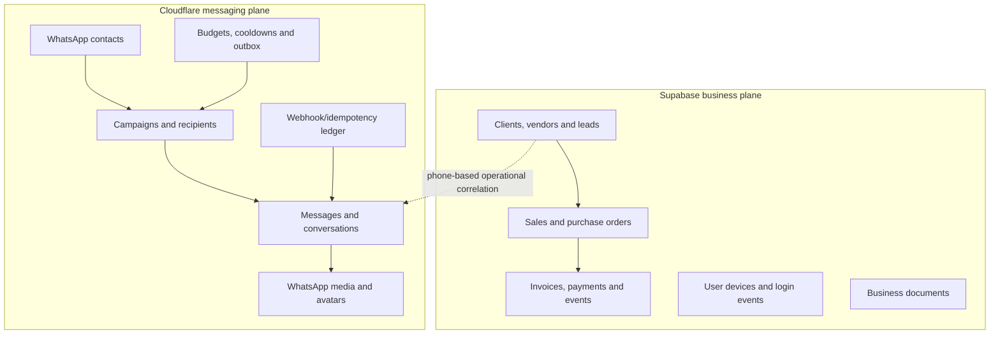
```mermaid
flowchart TB
    subgraph SUPABASE[Supabase business plane]
        CRM[Clients, vendors and leads]
        ORDERS[Sales and purchase orders]
        FINANCE[Invoices, payments and events]
        DEVICES[User devices and login events]
        DOCUMENTS[Business documents]
    end

    subgraph CLOUDFLARE[Cloudflare messaging plane]
        CONTACTS[WhatsApp contacts]
        CAMPAIGNS[Campaigns and recipients]
        MESSAGES[Messages and conversations]
        LEDGER[Webhook/idempotency ledger]
        BUDGETS[Budgets, cooldowns and outbox]
        MEDIA[WhatsApp media and avatars]
    end

    CRM --> ORDERS --> FINANCE
    CONTACTS --> CAMPAIGNS --> MESSAGES
    LEDGER --> MESSAGES
    BUDGETS --> CAMPAIGNS
    MESSAGES --> MEDIA
    CRM -. phone-based operational correlation .-> MESSAGES
```

The two data planes do not share a database transaction. Cross-plane workflows
must tolerate partial failure and reconcile using stable identifiers or
explicit operational keys.

### Representative Supabase relationships

The real schema contains historical and newer names side by side. This diagram
shows the intended domain relationships rather than every column.

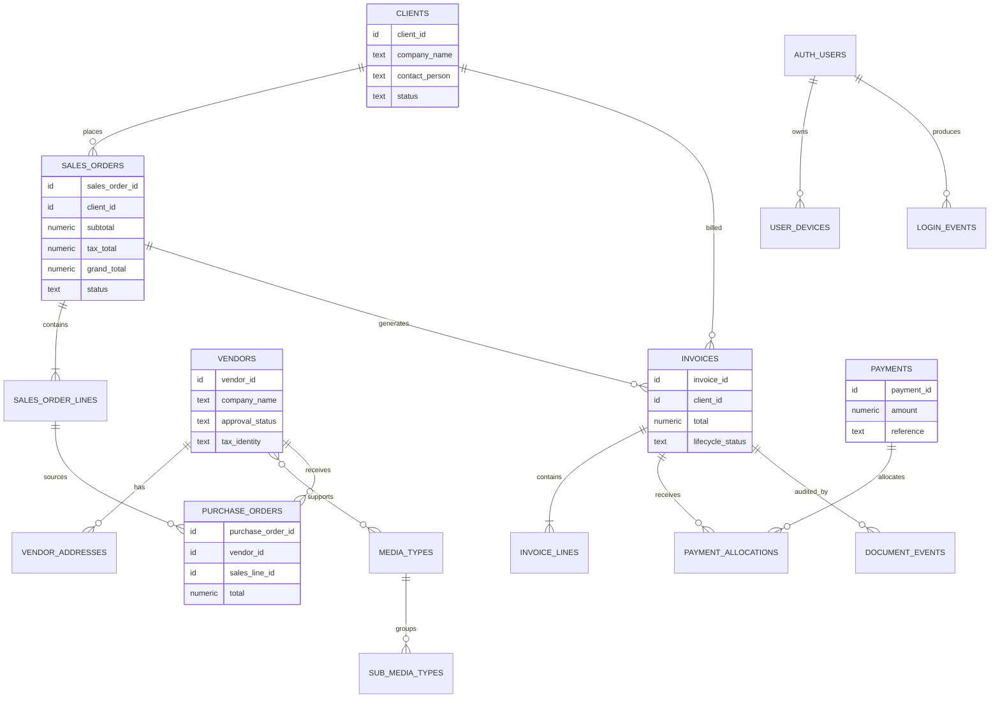
```mermaid
erDiagram
    CLIENTS ||--o{ SALES_ORDERS : places
    SALES_ORDERS ||--|{ SALES_ORDER_LINES : contains
    SALES_ORDER_LINES ||--o{ PURCHASE_ORDERS : sources
    VENDORS ||--o{ VENDOR_ADDRESSES : has
    VENDORS }o--o{ MEDIA_TYPES : supports
    MEDIA_TYPES ||--o{ SUB_MEDIA_TYPES : groups
    VENDORS ||--o{ PURCHASE_ORDERS : receives
    CLIENTS ||--o{ INVOICES : billed
    SALES_ORDERS ||--o{ INVOICES : generates
    INVOICES ||--|{ INVOICE_LINES : contains
    PAYMENTS ||--o{ PAYMENT_ALLOCATIONS : allocates
    INVOICES ||--o{ PAYMENT_ALLOCATIONS : receives
    INVOICES ||--o{ DOCUMENT_EVENTS : audited_by
    AUTH_USERS ||--o{ USER_DEVICES : owns
    AUTH_USERS ||--o{ LOGIN_EVENTS : produces

    CLIENTS {
        id client_id
        text company_name
        text contact_person
        text status
    }
    VENDORS {
        id vendor_id
        text company_name
        text approval_status
        text tax_identity
    }
    SALES_ORDERS {
        id sales_order_id
        id client_id
        numeric subtotal
        numeric tax_total
        numeric grand_total
        text status
    }
    PURCHASE_ORDERS {
        id purchase_order_id
        id vendor_id
        id sales_line_id
        numeric total
    }
    INVOICES {
        id invoice_id
        id client_id
        numeric total
        text lifecycle_status
    }
    PAYMENTS {
        id payment_id
        numeric amount
        text reference
    }
```

### Representative D1 relationships

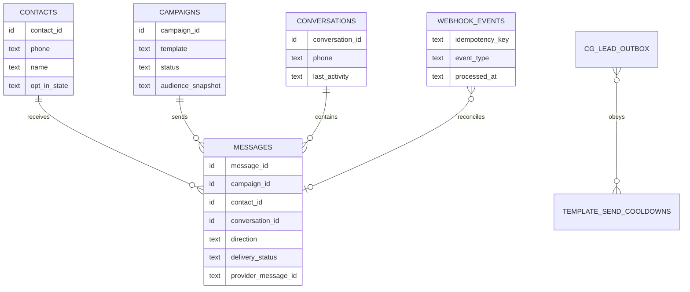
```mermaid
erDiagram
    CONTACTS ||--o{ MESSAGES : receives
    CAMPAIGNS ||--o{ MESSAGES : sends
    CONVERSATIONS ||--o{ MESSAGES : contains
    WEBHOOK_EVENTS }o--o| MESSAGES : reconciles
    CG_LEAD_OUTBOX }o--o{ TEMPLATE_SEND_COOLDOWNS : obeys

    CONTACTS {
        id contact_id
        text phone
        text name
        text opt_in_state
    }
    CAMPAIGNS {
        id campaign_id
        text template
        text status
        text audience_snapshot
    }
    CONVERSATIONS {
        id conversation_id
        text phone
        text last_activity
    }
    MESSAGES {
        id message_id
        id campaign_id
        id contact_id
        id conversation_id
        text direction
        text delivery_status
        text provider_message_id
    }
    WEBHOOK_EVENTS {
        text idempotency_key
        text event_type
        text processed_at
    }
```

The intended audience is stored as a campaign snapshot. A unique
`campaign_id`/`contact_id` message index is the atomic recipient claim; there is
no separate campaign-recipient table in the current schema.

### File ownership and access

```mermaid
flowchart LR
    subgraph BUSINESS[Business documents]
        VF[Vendor form]
        SS[(Private Supabase Storage)]
        STAFF[Authorized staff]
        VF -. current anonymous upload gap .-> SS
        STAFF -->|Short-lived signed access| SS
    end

    subgraph CHAT[WhatsApp media]
        META[Meta media]
        API[API Worker]
        R2[(Private R2)]
        TICKET[Short-lived media ticket]
        BROWSER[Authenticated browser]
        META --> API --> R2
        BROWSER --> TICKET --> API --> R2
    end
```

### Sources of truth

| Fact | Authoritative source | Derived/display copies |
| --- | --- | --- |
| User identity and session | Supabase Auth | Browser session state |
| Client/vendor master | Supabase PostgreSQL | Select lists and generated documents |
| Order and financial amounts | Persisted order/invoice rows | UI calculations and PDFs |
| WhatsApp campaign audience | D1 campaign recipient records | Dashboard counts |
| Message delivery status | D1 after Meta receipt reconciliation | Campaign/inbox UI |
| Business document | Private Supabase Storage plus owning row | Temporary signed URL |
| WhatsApp media | Private R2 object plus D1 metadata | Short-lived ticket URL |
| Public abuse budget | Guarded D1 daily budget row | UI/provider error message |

---

## 8. Security model

### Defense in depth

```mermaid
flowchart TB
    L1[1. Minimize exposed surface and public configuration]
    L2[2. Validate identity: Supabase JWT or provider signature]
    L3[3. Authorize organization, role, row and object action]
    L4[4. Validate and bound all untrusted input]
    L5[5. Enforce RLS, private storage and server-only secrets]
    L6[6. Apply idempotency, cooldowns and global budgets]
    L7[7. Sanitize errors, logs and operational evidence]
    L8[8. Monitor, reconcile, rotate and recover]

    L1 --> L2 --> L3 --> L4 --> L5 --> L6 --> L7 --> L8
```

No individual layer replaces another. For example, Turnstile reduces automated
abuse but does not replace a byte limit or global storage budget. CORS limits
browser origins but does not authorize a user.

### Trust-boundary map

```mermaid
flowchart LR
    subgraph UNTRUSTED[Untrusted]
        PUBLIC[Public browser]
        AUTHB[Authenticated browser input]
        WEBHOOK[Provider request]
        FILE[Uploaded file or archive]
    end

    subgraph GATES[Verification gates]
        TURN[Turnstile and public limits]
        JWT[JWT plus role check]
        HMAC[Raw-body signature and replay check]
        PARSER[Byte, type, signature and expansion limits]
    end

    subgraph TRUSTED[Controlled server actions]
        RPC[Narrow service-role RPC]
        SQL[Bound D1 statements]
        STORE[Generated private object key]
        SEND[Idempotent budgeted provider call]
    end

    PUBLIC --> TURN --> RPC
    AUTHB --> JWT --> SQL
    WEBHOOK --> HMAC --> SQL
    FILE --> PARSER --> STORE
    JWT --> SEND
```

### Current risk picture

| Priority | Boundary | Current condition | Required end state |
| --- | --- | --- | --- |
| P0 | Public vendor documents | Browser-direct anonymous upload | Verified, bounded, server-controlled upload |
| P0 | Vendor document access | Historical broad authenticated policies | Organization/vendor/role-scoped actions |
| P1 | Internal authorization | Valid session broadly trusted | Explicit role and organization permission |
| P1 | XLSX/media processing | Some complete buffering and weak expansion limits | Pre-buffer byte and decompression ceilings |
| P2 | Browser response | Incomplete security-header set | Tested CSP, HSTS, nosniff and policy headers |
| P2 | Observability | Some personal fields can reach logs | Allowlisted, minimized and retention-controlled logs |
| P2 | Regression protection | No comprehensive automated suite | API/RLS/upload/webhook/security tests in CI |

### Security remediation dependency graph

```mermaid
flowchart TD
    A[Define safe upload contract]
    B[Implement verified Worker upload]
    C[Move browser to new path]
    D[Test valid, invalid, oversized and replay cases]
    E[Remove anonymous Storage INSERT]
    F[Scope read, update and delete policies]
    G[Verify effective production policies]

    A --> B --> C --> D --> E --> F --> G

    R1[Define role matrix]
    R2[Create membership and roles]
    R3[Enforce API permissions]
    R4[Enforce matching RLS]
    R5[Test cross-role and cross-organization denial]

    R1 --> R2 --> R3 --> R4 --> R5
```

The order matters: removing the old public grant before the replacement path is
deployed breaks vendor registration; deploying the replacement without limits
leaves the abuse risk open.

---

## 9. Failure and recovery model

```mermaid
stateDiagram-v2
    [*] --> Requested
    Requested --> Validated: input and permission accepted
    Requested --> Rejected: invalid, unauthorized or over budget
    Validated --> Claimed: idempotency/ownership recorded
    Claimed --> Completed: all required side effects persisted
    Claimed --> Retryable: provider timeout or temporary failure
    Retryable --> Claimed: bounded retry
    Claimed --> Reconcile: callback arrived out of order
    Reconcile --> Completed: state repaired
    Reconcile --> ManualReview: ambiguity remains
    Completed --> [*]
    Rejected --> [*]
    ManualReview --> [*]
```

Expected behavior for high-impact operations:

- record intent before an irreversible send where practical;
- use a stable idempotency key or atomic claim;
- show partial success rather than claiming full completion;
- keep enough audit state to reconcile;
- use an explicit correction workflow for financial records;
- fail closed when verification or authorization dependencies are unavailable;
- never restore availability by broadening public or authenticated access.

---

## 10. Future configurable public release

### Distribution model

```mermaid
flowchart LR
    SOURCE[Public release source]
    SETUP[Setup assistant or documented installer]
    BRAND[Organization branding package]
    CLOUD[Organization cloud accounts]
    DATABASE[Organization database and storage]
    PROVIDERS[Organization provider credentials]
    ADMIN[First administrator]
    INSTANCE[Isolated organization instance]

    SOURCE --> SETUP
    SETUP --> BRAND
    SETUP --> CLOUD
    SETUP --> DATABASE
    SETUP --> PROVIDERS
    SETUP --> ADMIN
    BRAND --> INSTANCE
    CLOUD --> INSTANCE
    DATABASE --> INSTANCE
    PROVIDERS --> INSTANCE
    ADMIN --> INSTANCE
```

This target is not “paste secrets into the browser and deploy.” A safe setup
process separates public configuration from secret stores, applies migrations,
checks RLS, creates an administrator through a controlled path, and runs a
health/security checklist.

### Configuration layers

```mermaid
flowchart LR
    CORE[Versioned core application]

    subgraph PUBLIC[Browser-public inputs]
        PUBLICCFG[Public instance configuration]
        BRANDCFG[Validated brand package]
    end

    subgraph PRIVATE[Privileged inputs]
        SERVERCFG[Server-only environment and secrets]
        BINDINGS[Cloud resource bindings]
    end

    subgraph DATA[Durable data setup]
        DATASETUP[Ordered database migrations]
        REFERENCE[Reviewed seed/reference data]
    end

    CORE --> SPABUILD[SPA build]
    PUBLICCFG --> SPABUILD
    BRANDCFG --> SPABUILD
    CORE --> SERVER[API and Edge runtimes]
    SERVERCFG --> SERVER
    BINDINGS --> SERVER
    DATASETUP --> DATABASES[Organization databases and Storage]
    REFERENCE --> DATABASES
    SPABUILD --> INSTANCE[Organization instance]
    SERVER --> INSTANCE
    DATABASES --> INSTANCE
```

The split is a security boundary: public identity and endpoints may enter the
downloaded SPA, while service-role keys, provider tokens and signing material
flow only to server runtimes. Database migrations run against data services;
they are not browser build inputs.

| Configuration area | Example values | Storage rule |
| --- | --- | --- |
| Brand identity | Organization name, logo, colors, document footer | Versioned non-secret config/assets |
| Public URLs | App origin, API origin, Supabase URL | Environment-specific public config |
| Public keys | Supabase publishable key, Turnstile site key | Public config; still validate server-side |
| Private credentials | Service-role, signing and provider secrets | Cloud secret stores only |
| Organization profile | Legal name, tax identity, address, invoice prefix | Protected database record |
| Provider options | WhatsApp template names, feature availability | Versioned names/config, secrets separate |
| Policy | Roles, approval gates, retention and limits | Database/config with reviewed defaults |

### Rebranding boundary

```mermaid
flowchart LR
    subgraph CUSTOMIZABLE[Safe to customize]
        LOGO[Logo and favicon]
        COLORS[Color tokens]
        COPY[Organization-facing copy]
        DOCS[PDF/document identity]
        MODULES[Enabled modules]
        PROVIDERS[Provider configuration]
    end

    subgraph INVARIANT[Must remain enforced]
        AUTH[Authentication and authorization]
        RLS[RLS and private Storage]
        LIMITS[Upload and parsing limits]
        SIGNATURES[Webhook signature verification]
        IDEMPOTENCY[Idempotency and reconciliation]
        BUDGETS[Global cost/send limits]
        AUDIT[Financial and security audit history]
    end

    CUSTOMIZABLE --> PRODUCT[Branded organization instance]
    INVARIANT --> PRODUCT
```

Branding is configuration. Security behavior is not a theme option.

### Public-release readiness gates

```mermaid
flowchart TD
    G1[Security audit P0/P1 findings closed]
    G2[Automated authorization and migration tests]
    G3[Brand values removed from business logic]
    G4[Validated setup, upgrade and rollback path]
    G5[Example environment contains placeholders only]
    G6[Backup, retention and incident runbooks exercised]
    G7[License, support and contribution model selected]
    G8[First clean-room installation succeeds]
    READY[Public release candidate]

    G1 --> G2 --> G3 --> G4 --> G5 --> G6 --> G7 --> G8 --> READY
```

### Upgrade lifecycle

```mermaid
flowchart TD
    BASE[Identify installed revision and deployed units]
    NOTES[Review changelog, diff, migrations and configuration names]
    COMPAT{Backward-compatible rollout?}
    ADD[Add schema, policy and server support first]
    CLIENT[Release compatible SPA]
    REMOVE[Remove obsolete compatibility in a later change]
    VERIFY[Run allowed, denied, failure and smoke checks]
    OBSERVE[Observe sanitized health and business invariants]
    DONE[Record component revisions and outcome]
    HOLD[Stop and design an explicit maintenance window or forward migration]

    BASE --> NOTES --> COMPAT
    COMPAT -->|yes| ADD --> CLIENT --> VERIFY --> OBSERVE --> REMOVE --> DONE
    COMPAT -->|no| HOLD
    HOLD --> VERIFY
```

An application revision is not a single artifact. The SPA, API Worker, D1,
Supabase migrations, Edge Functions and provider configuration can move at
different times. [UPGRADING.md](docs/UPGRADING.md) defines compatibility,
evidence and rollback expectations; [CHANGELOG.md](CHANGELOG.md) records
notable repository changes but never proves that production was updated.

### Explicit non-goals for the first public version

- A shared database serving unrelated organizations.
- A central service that stores every customer's provider credentials.
- One-click deployment that silently chooses insecure defaults.
- Open self-registration before administrator provisioning and role controls.
- Unlimited message sending, public uploads or external API spending.
- Claiming compatibility with every accounting, messaging or storage provider.

---

## 11. Repository map

```mermaid
flowchart TB
    ROOT[Repository root]
    ROOT --> SRC[src]
    ROOT --> SB[supabase]
    ROOT --> MIG[migrations]
    ROOT --> SCRIPTS[scripts]
    ROOT --> DOCS[docs]
    ROOT --> PUBLIC[public]

    SRC --> APP[app: router composition]
    SRC --> COMPONENTS[components: shared UI]
    SRC --> FEATURES[features: product modules]
    SRC --> LIB[lib: browser clients and utilities]
    SRC --> API[api: Hono Worker]
    SRC --> SPAWORKER[worker.js: standalone SPA Worker, unused in production]

    API --> MIDDLEWARE[middleware]
    API --> ROUTES[routes]
    API --> SERVICES[services and providers]

    SB --> SBMIG[PostgreSQL, RLS and Storage migrations]
    SB --> FUNCTIONS[Edge Functions]
    MIG --> D1MIG[D1 migrations]
    SCRIPTS --> OPSCRIPTS[Operational utilities]
    SCRIPTS --> PREVIEWS[Synthetic screenshot harnesses]

    DOCS --> ADR[Architecture decisions]
    DOCS --> TASKS[Cross-session task briefs]
    DOCS --> RUNBOOKS[Operational runbooks]
    DOCS --> ASSETS[Documentation visuals]
```

### Change-impact guide

| If changing… | Inspect first | Verify at minimum |
| --- | --- | --- |
| Public form | Public route, Turnstile service, RPC grants, Storage policy | Missing/invalid/replayed token, direct-RPC denial, size limits |
| Auth | Login UI, Supabase Auth config, OTP hook, device function | Unknown user, invalid/expired OTP, signature failure, no OTP logging |
| API route | Route classification, `requireAuth`, role requirement | 401, 403, malformed input, timeout and idempotency |
| Supabase table | Migrations, grants, RLS, browser queries | `anon` and authenticated allow/deny matrix |
| D1 table | Ordered D1 migration and route queries | Clean migration, existing rows and concurrency behavior |
| File processing | Request body path, parser and storage adapter | Empty, oversized, wrong type, bad signature and archive bomb |
| WhatsApp send | Audience claim, template rules, Meta adapter, webhooks | Duplicate request, partial failure and out-of-order receipt |
| Finance | Amount helpers, persisted rows, generated document | Rounding, reconciliation, immutability and correction path |
| Brand | CSS tokens, public assets, generated documents and copy | Light/dark, mobile, no brand value in security logic |

---

## 12. Build, deploy and operate

### Local-to-production path

```mermaid
flowchart LR
    CHANGE[Focused code/document change]
    CHECK[npm run check]
    BEHAVIOR[Relevant behavioral and denial tests]
    REVIEW[Human review]
    STAGE[Development or staging deployment]
    SMOKE[Smoke test and policy verification]
    PROD[Approved release: SPA by push to main, API by deploy:api]
    OBSERVE[Sanitized monitoring]
    ROLLBACK[Rollback or forward correction]

    CHANGE --> CHECK --> BEHAVIOR --> REVIEW --> STAGE --> SMOKE --> PROD --> OBSERVE
    SMOKE -. unsafe .-> ROLLBACK
    OBSERVE -. regression .-> ROLLBACK
```

`npm run check` means lint, the tests in `tests/`, a production build and
high-signal source/build secret scanning. The tests cover isolated security
helpers; route, policy and UI behavior still need automated tests.

### Deployment units

| Unit | Source/configuration | Owns |
| --- | --- | --- |
| SPA | Cloudflare Pages project building `dist/` from every push to `main` | Routes and static frontend assets |
| API Worker | `src/api/worker.js`, `wrangler.api.jsonc` | Hono API, D1/R2, integrations, scheduled work |
| Supabase database | `supabase/migrations/` | PostgreSQL schema, grants, RLS and Storage policies |
| Supabase Edge Function | `supabase/functions/device-check/` | Device/login audit and optional alert |
| Provider consoles | External approved configuration | WhatsApp templates/hooks, Turnstile and API access |

### Operational ownership still required

```mermaid
flowchart TB
    OWNER[System owner]
    OWNER --> CF[Cloudflare owner]
    OWNER --> SB[Supabase owner]
    OWNER --> META[Meta/WhatsApp owner]
    OWNER --> FIN[Finance/data owner]
    OWNER --> SEC[Incident commander]

    CF --> ROTATE[Credential rotation]
    SB --> BACKUP[Backup and restore]
    META --> SENDS[Messaging policy and spend]
    FIN --> RETENTION[Retention and correction rules]
    SEC --> INCIDENT[Incident response and notification]
```

Exact people and private contact paths belong in an approved operations system,
not the repository.

---

## 13. AI and contributor navigation

```mermaid
flowchart TD
    START[New task]
    AGENT[Read root AGENTS.md]
    SCOPE{Which area changes?}
    APIA[Read src/api/AGENTS.md]
    SBA[Read supabase/AGENTS.md]
    D1A[Read migrations/AGENTS.md]
    PRODUCT[Read relevant product, invariant and architecture docs]
    BRIEF{Spans sessions or risky rollout?}
    TASK[Create docs/tasks brief]
    WORK[Implement smallest complete change]
    VERIFY[Run proportional verification]
    UPDATE[Update durable docs or ADR]
    HANDOFF[Record checks, gaps and rollout notes]

    START --> AGENT --> SCOPE
    SCOPE -->|API| APIA --> PRODUCT
    SCOPE -->|Supabase| SBA --> PRODUCT
    SCOPE -->|D1| D1A --> PRODUCT
    SCOPE -->|Other| PRODUCT
    PRODUCT --> BRIEF
    BRIEF -->|yes| TASK --> WORK
    BRIEF -->|no| WORK
    WORK --> VERIFY --> UPDATE --> HANDOFF
```

`AGENTS.md` is the canonical shared instruction entry point. Do not duplicate
it into a root `MEMORY.md`, `CLAUDE.md` or tool-specific configuration file.
`.claude/settings.json` and `.codex/config.toml` should exist only when a
concrete, reviewed tool setting is required; local permission choices and
credentials stay untracked. See [AI-WORKFLOW.md](docs/AI-WORKFLOW.md).

Recommended reading order for understanding the whole repository:

1. this file;
2. [AGENTS.md](AGENTS.md);
3. [Product direction](docs/PRODUCT.md) and
   [system invariants](docs/INVARIANTS.md);
4. [Architecture](docs/ARCHITECTURE.md) and
   [Database](docs/DATABASE.md);
5. [Security audit](docs/SECURITY-AUDIT.md) and
   [Roadmap](docs/ROADMAP.md);
6. [AI workflow](docs/AI-WORKFLOW.md) for work that spans tools or sessions;
7. the relevant feature, API route and migration code.

---

## 14. Glossary

| Term | Meaning here |
| --- | --- |
| API Worker | Cloudflare Worker running the Hono application API |
| Cloudflare Pages | Hosts the React build in production; every push to `main` deploys it |
| SPA Worker | Standalone Worker in `wrangler.jsonc` and `src/worker.js`; not used by production |
| D1 | Cloudflare SQLite-compatible database for messaging operations |
| R2 | Cloudflare object storage for re-hosted WhatsApp media and avatars |
| RLS | PostgreSQL Row Level Security protecting browser-accessible rows |
| Service role | Privileged Supabase server credential; never browser-visible |
| Turnstile | Server-verified challenge used as public-form bot friction |
| OTP | One-time code used for passwordless authentication |
| Idempotency | Repeating a request/event does not repeat its business side effect |
| Reconciliation | Repairing state after partial failure or out-of-order events |
| Media ticket | Short-lived signed capability for a specific protected media path |
| Global budget | Authoritative daily limit on a paid or abuse-sensitive operation |
| ADR | Architecture Decision Record under `docs/decisions/` |
| Organization instance | One independently configured and hosted installation |

---

## 15. Maintaining this handbook

Update `VISUALIZE.md` when any of these change:

- a user-visible module or route is added or removed;
- a deployment unit, database or provider boundary changes;
- the source of truth for business data changes;
- authentication, authorization, public intake or file access changes;
- a placeholder workflow becomes implemented;
- the public-release/configuration model changes;
- screenshots no longer resemble the current interface.

Screenshot rules:

1. Use local synthetic preview data for authenticated records and aggregates.
2. Never capture live contacts, phone numbers, emails, documents or message
   content.
3. Never capture browser developer tools, environment files, provider consoles
   or URLs containing tokens.
4. Label conceptual art and synthetic screenshots honestly.
5. Review images visually before committing them.

Diagram rules:

1. Prefer Mermaid for factual diagrams so changes remain reviewable.
2. Show logical service names, not private account/project identifiers.
3. Mark target-state controls that are not implemented.
4. Keep detailed policy and migration instructions in their specialist docs.
5. Re-run the Markdown link and secret scans after every update.

The handbook is an orientation map, not proof of deployed state. Production
truth still requires inspecting the effective Cloudflare bindings, Supabase
schema/RLS/Storage policies and provider configuration through approved access.
