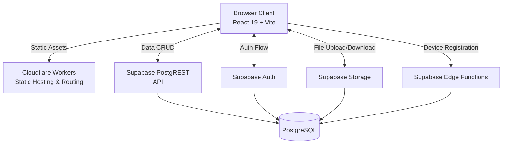
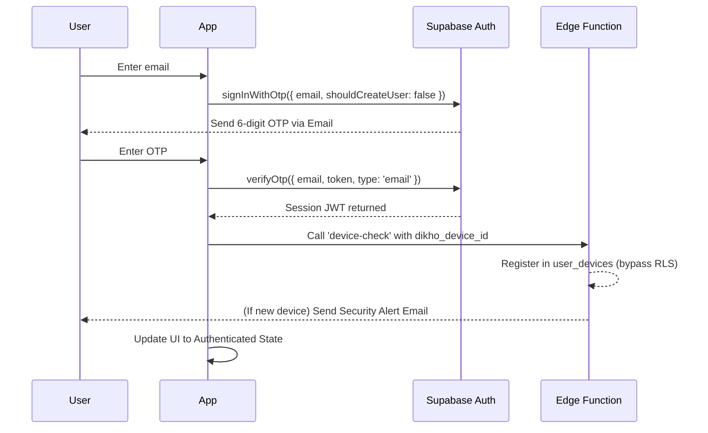
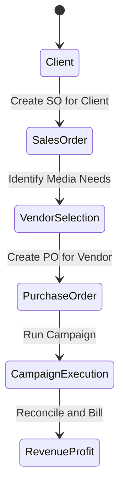

# Dikho Technical Architecture

Dikho is an internal advertising operations platform that manages the workflow between clients, sales orders, vendors, and purchase orders. It replaces spreadsheets with a structured digital system for Indian advertising agencies.

## System Overview



## Tech Stack

- **Frontend**: React 19.2.8 with Vite 8.2.0
- **Backend**: Supabase (PostgreSQL, PostgREST API, Auth, Storage, Edge Functions)
- **Deployment**: Cloudflare Workers (primary), Docker/Nginx (alternative)
- **Language**: JavaScript/JSX (no TypeScript on frontend)
- **Styling**: Vanilla CSS with CSS custom properties, no CSS framework
- **Linter**: oxlint with React plugin
- **Dependencies**: `@supabase/supabase-js`, `country-state-city`, `react`, `react-dom`

## File Structure

```
dikho/
├── public/                     # Static assets (logos, favicon, icons)
├── src/
│   ├── assets/                 # Build-time assets (hero image)
│   ├── pages/
│   │   ├── PublicVendorForm.jsx  # Public vendor registration (4-step wizard)
│   │   └── PurchaseOrders.jsx    # Purchase order management module
│   ├── App.jsx                 # Core app: auth, shell, clients, vendors, SOs, settings, utilities
│   ├── App.css                 # Empty (all styles in index.css)
│   ├── ContactDetails.jsx      # Agency contact card component
│   ├── ContactDetails.css      # Contact card styles
│   ├── ContactHoverAction.jsx  # Table cell phone/email action buttons
│   ├── index.css               # Complete design system (2,900 lines)
│   ├── main.jsx                # React entry point
│   ├── supabase.js             # Supabase client init
│   └── xlsx.js                 # Zero-dep Excel file generator
├── supabase/
│   ├── functions/
│   │   └── device-check/index.ts  # Device tracking Edge Function (Deno)
│   └── migrations/             # SQL migration files
├── preview/                    # Offline component test harnesses
├── docs/                       # Project documentation
├── .github/workflows/          # CI pipeline
├── Dockerfile                  # Alternative Docker deployment
├── wrangler.jsonc              # Cloudflare Workers config
├── vite.config.js              # Vite + React + Cloudflare plugin
├── package.json                # Dependencies and scripts
└── CONTRIBUTING.md             # Developer guide
```

## Frontend Architecture

### Routing
- **Hybrid URL + in-memory state routing** (no React Router)
- **Public route**: `window.location.pathname === '/vendor/register'` renders `[PublicVendorForm.jsx](file:///home/alice/dikho/src/pages/PublicVendorForm.jsx)` without authentication
- **Authenticated app**: `activePage` state in `[App.jsx](file:///home/alice/dikho/src/App.jsx)` switches between pages: `clients`, `vendors`, `so`, `po`, `dashboard`, `invoice`, `advance`, `receipt`, `paymentrequest`, `courier`, `settings`
- **Preview harnesses**: Found in `/preview/` directory for offline component testing

### Component Structure
Most of the application lives in `[App.jsx](file:///home/alice/dikho/src/App.jsx)` (4,902 lines), which contains:
- **Icon system**: 24+ inline SVG icons via `Icon({ name, size })` component
- **Login component**: 2-step email OTP auth with 6-digit input, paste support, resend cooldown
- **Sidebar**: Collapsible navigation with mobile overlay support
- **Clients module**: CRUD with search, pagination, detail drawer, add modal
- **Vendors module**: CRUD with slash-command chained search (`/state/country/media/sub_media`), Excel export, document viewer with signed URLs, contact hover actions
- **Sales Orders module**: Parent-child (salesorder/salesorderdocument), multi-item editor, GST tax calculations, status workflow, drift detection
- **Settings page**: Light/Dark/System theme switcher
- **Placeholder pages**: For unbuilt modules
- **30+ exported utility functions**: formatMoney, splitGst, itemAmounts, round2, etc.

Separate files include:
- `[PurchaseOrders.jsx](file:///home/alice/dikho/src/pages/PurchaseOrders.jsx)` (1,461 lines): Full PO procurement module with vendor linking, SO association, profit calculation
- `[PublicVendorForm.jsx](file:///home/alice/dikho/src/pages/PublicVendorForm.jsx)` (827 lines): 4-step public vendor onboarding form with Cloudflare Turnstile captcha
- `[ContactDetails.jsx](file:///home/alice/dikho/src/ContactDetails.jsx)`: Agency contact card with animated call/email buttons
- `[ContactHoverAction.jsx](file:///home/alice/dikho/src/ContactHoverAction.jsx)`: Inline phone/email action buttons for table cells
- `[xlsx.js](file:///home/alice/dikho/src/xlsx.js)` (188 lines): Zero-dependency .xlsx file generator (builds valid OOXML ZIP archives)
- `[supabase.js](file:///home/alice/dikho/src/supabase.js)`: Supabase client initialization

### State Management
- No external state library (no Redux, Zustand, Context API)
- All state via React hooks: `useState`, `useRef`, `useMemo`, `useCallback`
- Persistent state in `localStorage`: theme preference (`dikho-theme`), device ID (`dikho_device_id`)
- Session state managed by Supabase auth

### Styling
- `[index.css](file:///home/alice/dikho/src/index.css)` (2,900 lines): Complete design system with CSS custom properties
- Theme tokens: `--brand-blue: #185494`, `--accent: #f9af1b`, `--sidebar: #171f30`
- Dark theme via `[data-theme="dark"]` selector overriding CSS variables
- System theme detection via `prefers-color-scheme` media query
- Modern CSS features: `@starting-style`, `transition-behavior: allow-discrete`, `backdrop-filter: blur()`
- `[ContactDetails.css](file:///home/alice/dikho/src/ContactDetails.css)`: Styles for contact action components

## Authentication & Session Management

### Auth Flow



### Session Security
- **Inactivity timeout**: 45 minutes (`INACTIVITY_MS`)
- **Maximum session cap**: 8 hours (`MAX_SESSION_MS`)
- **Warning**: 5-minute warning before inactivity logout with countdown modal
- **Activity tracking**: via mousemove, keydown, pointerdown, scroll events
- **Idle checks**: 1-second interval checks idle time

## Backend Architecture

### Supabase Services Used
1. **PostgREST API**: All database CRUD via `supabase.from('table').select/insert/update/delete`
2. **Auth**: Email OTP passwordless authentication, JWT-based sessions
3. **Storage**: Private bucket `Dikho` for vendor documents and SO attachments
4. **Edge Functions**: `device-check` Deno function for device registration and alerts

### Schema-Tolerant Write Engine
The `writeRows` function in the app implements an adaptive persistence pattern:
1. Attempts to insert/upsert rows
2. If PostgREST returns `PGRST204` (column not found), removes the unknown column and retries
3. If Postgres returns `23502` (NOT NULL violation), applies fallback default values and retries
4. Bounded to `MAX_WRITE_ATTEMPTS = 8` retries

This allows the frontend to survive database schema changes without immediate code updates.

## Business Logic

### Core Business Workflow



### GST Tax Calculation
- Indian GST types supported: CGST+SGST, IGST, UTGST+CGST
- Standard rates: 0%, 5%, 12%, 18%, 28%
- Client-side reconciliation before every write:
  - `sub_total = Σ taxable_amount`
  - `tax_total = Σ tax_amount`
  - `total = Σ after_tax_amount`
- Per item: 
  - `taxable_amount + tax_amount = after_tax_amount`
  - `tax_amount = cgst + sgst + igst + utgst`
- Odd-paisa reconciliation: `cgst = round2(tax/2); sgst = round2(tax - cgst)`
- Drift detection: compares stored parent totals against recomputed child item sums

### Advertising Categories
Organized into three tiers:
- **ATL (Above the Line)**: Television, Radio, Newspaper, Cinema, Magazine, Sports Marketing
- **TTL (Through the Line)**: Digital Marketing, Digital PR, OTT & Apps, SEO
- **BTL (Below the Line)**: Airport, Transit, Outdoor, Corporate Giftings, In-Shop Branding, Activations, etc.

## Deployment Architecture
- **Primary**: Cloudflare Workers with SPA fallback routing (`[wrangler.jsonc](file:///home/alice/dikho/wrangler.jsonc)`)
- **Alternative**: Docker multi-stage build → nginx:alpine serving static files (`[Dockerfile](file:///home/alice/dikho/Dockerfile)`)
- **Supabase**: Managed PostgreSQL, hosted Edge Functions, managed Auth
- **CI**: GitHub Actions on push/PR to main, tests on Node 20.x and 22.x
