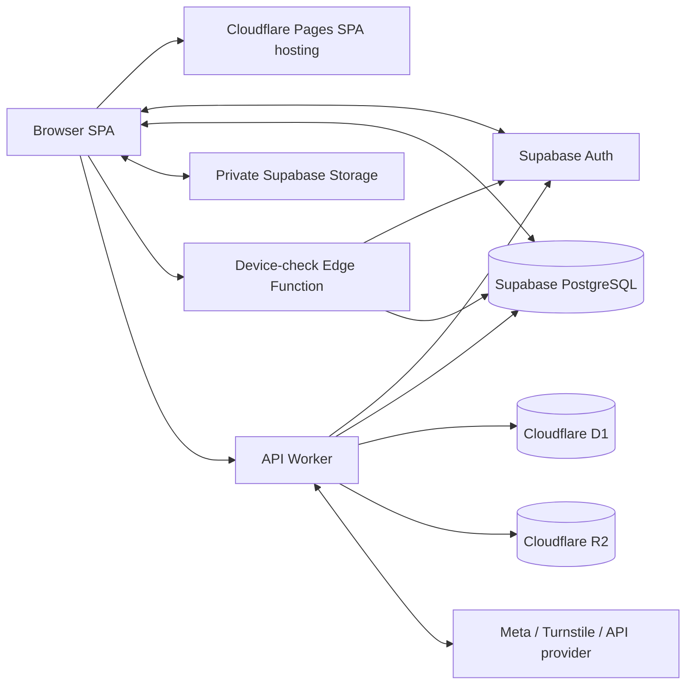
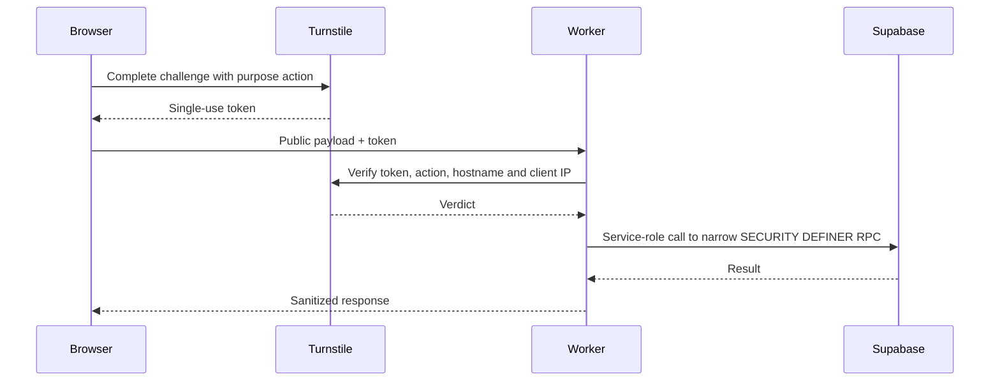

# Dikho Technical Architecture

Last updated: 2026-10-04

Dikho is a browser application backed by two cloud data planes: Supabase for
business records and identity, and Cloudflare for the application API,
WhatsApp operations and media delivery.

## System overview

```mermaid
flowchart LR
    B[Browser SPA]
    S[Cloudflare Pages SPA hosting]
    A[API Worker]
    AU[Supabase Auth]
    PG[(Supabase PostgreSQL)]
    ST[Private Supabase Storage]
    EF[Device-check Edge Function]
    D1[(Cloudflare D1)]
    R2[(Cloudflare R2)]
    EXT[Meta / Turnstile / API provider]

    B --> S
    B <--> AU
    B <--> PG
    B <--> ST
    B --> EF
    B --> A
    A --> AU
    A --> PG
    A --> D1
    A --> R2
    A <--> EXT
    EF --> AU
    EF --> PG
```

Cloudflare Pages serves the SPA, and the API Worker is deployed separately.
Secrets and privileged bindings belong only to server runtimes. The browser
contains a Supabase publishable key and public endpoints; security comes from
RLS, signature verification and server-side authorization, not identifier
secrecy.

## Frontend

The React app starts at `src/main.jsx`, builds routes in `src/routes.jsx`, and
uses two shells:

- `PublicLayout` for public vendor and corporate-gifting pages;
- `AuthenticatedLayout` for the internal dashboard and session controls.

Feature modules live under `src/features/`. Route-level features are lazy
loaded. `src/lib/supabase.js` owns the browser Supabase client and
`src/lib/api.js` owns calls to the API Worker.

The browser talks directly to Supabase PostgREST for several business features.
Those calls are authorized by PostgreSQL RLS. Hiding navigation or checking a
session in React does not protect the underlying rows.

## Authentication and sessions

### Email OTP

The browser calls Supabase Auth with `shouldCreateUser: false`, so only users
already provisioned by an administrator can request a code. Supabase verifies
the OTP and returns the session.

### WhatsApp OTP

Supabase generates the OTP and invokes the API Worker's Send SMS hook. The
Worker verifies the Standard Webhooks signature over the raw body and delivers
the code through an approved WhatsApp authentication template. Supabase, not the
Worker, verifies the submitted OTP and issues the session.

### Device audit

After login, the browser calls the `device-check` Edge Function with a random
local device identifier. The function validates the user's JWT, uses the
service role to record the device/login event, and may send a new-device alert.
The identifier is an audit aid, not device attestation.

### API authentication

Protected API routes send the Supabase bearer token. `requireAuth` validates it
with Supabase and exposes the user ID/email to handlers. Fine-grained roles and
organization membership are not yet enforced by this middleware; this is a
documented high-priority security gap.

## Application API

`src/api/app.js` builds a Hono application under `/api`.

Public routes:

- health check;
- Meta webhook verification and signed webhook delivery;
- signed Supabase WhatsApp-OTP hook;
- Turnstile-protected public form writes;
- format-gated, budgeted GSTIN lookup;
- ticket-protected WhatsApp media and public avatar reads.

Authenticated routes:

- contacts/import and deletion;
- WhatsApp templates and campaigns;
- corporate-gifting lead status;
- WhatsApp conversations, replies and media uploads;
- media-ticket issuance and reconciliation;
- avatar upload.

Every new route must be explicitly classified as public or authenticated. A
mixed router should apply authentication at the individual handler.

## Public-form trust boundary

```mermaid
sequenceDiagram
    participant Browser
    participant Turnstile
    participant Worker
    participant Supabase

    Browser->>Turnstile: Complete challenge with purpose action
    Turnstile-->>Browser: Single-use token
    Browser->>Worker: Public payload + token
    Worker->>Turnstile: Verify token, action, hostname and client IP
    Turnstile-->>Worker: Verdict
    Worker->>Supabase: Service-role call to narrow SECURITY DEFINER RPC
    Supabase-->>Worker: Result
    Worker-->>Browser: Sanitized response
```

The latest lockdown migration removes anonymous execution of the two public
write RPCs. This makes the Worker verification path load-bearing.

Vendor documents are currently an exception: the public form uploads them
directly to Supabase Storage using an anonymous path-scoped INSERT policy. The
upload therefore happens outside this verified flow and must be moved behind a
server-controlled authorization flow.

## WhatsApp data plane

D1 contains messaging contacts, campaigns, conversations, messages, webhook
events, send cooldowns, global daily budgets and the delayed confirmation
outbox. R2 stores re-hosted inbound/outbound media and avatars.

Meta webhooks are checked using the app-secret HMAC over the raw request body.
Events enter an idempotency ledger before changing message state. Status
receipts that arrive before their message row are parked and reconciled later.

Authenticated browser media elements cannot attach bearer headers, so the API
issues short-lived HMAC media tickets. A ticket is not a Supabase session, but
it grants access to the protected media route until expiry and must not be
logged or shared.

## External integrations

| Integration | Trust mechanism | Main risk control |
| --- | --- | --- |
| Supabase Auth hook | timestamped HMAC | raw-body verification and replay window |
| Meta webhook | HMAC-SHA256 | raw-body verification and idempotency ledger |
| Turnstile | server verification | action/hostname checks and fail-closed config |
| GST provider | server-held API key | format/checksum gate, edge cache, rate brake, daily budget |
| Meta sends | server-held access token | authentication, idempotency, batch/concurrency limits |
| Alert email | server-held provider key | best-effort delivery and sanitized logging |

## Data ownership and authorization

Supabase business tables are primarily team-wide for authenticated users. D1
dashboard routes likewise accept any validated dashboard session. This matches
the current single trusted-team model but does not safely support multiple
organizations or partially trusted roles.

The target model is explicit organization membership plus named permissions
enforced in both RLS and API middleware. Until implemented, creating a Supabase
user effectively grants broad internal access and must remain an administrator
operation.

For the planned public distribution, the first supported topology is one
organization per independently hosted instance. Brand assets, public
configuration and provider adapters should be replaceable without modifying
core authorization or data-integrity logic. Shared multi-tenant hosting is not
part of the current architecture.

## Availability and spend controls

- GSTIN lookups use validation, a Cloudflare rate limiter, cache, and a global
  D1 daily ceiling. The global budget is authoritative; edge rate limiting is
  intentionally treated as permissive.
- Public WhatsApp confirmations use per-number cooldowns and a global daily
  send ceiling.
- Campaign sends claim message rows atomically and constrain concurrency.
- Webhook processing is idempotent and reconciliation repairs ordering races.

## Security boundaries still being hardened

See [Security audit](SECURITY-AUDIT.md) for owners/status. The most important
architectural changes are protected document upload, scoped storage policies,
role-aware authorization, bounded archive/media processing, browser response
headers and security regression tests.

## Deployment units

- SPA: a Cloudflare Pages project builds `dist/` from every push to `main`
  and serves it in production. `wrangler.jsonc` and `src/worker.js` describe a
  standalone SPA Worker that production does not use.
- API Worker: `wrangler.api.jsonc`, `src/api/worker.js`, D1/R2/rate bindings.
- Supabase: Auth configuration, PostgreSQL migrations, Storage policies and the
  `device-check` Edge Function.
- External dashboards: Meta templates/webhooks, Turnstile widget and API/mail
  provider configuration.

Configuration names may be documented; credential values and private resource
identifiers must not be committed.
