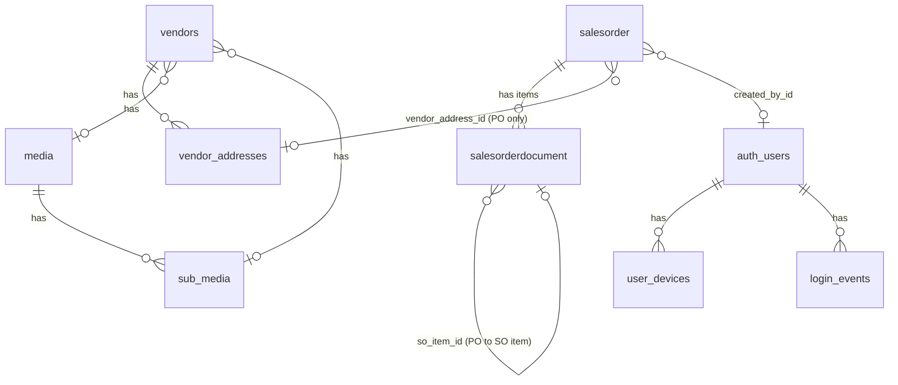

# Dikho Database Schema Documentation

## Overview
The Dikho project uses PostgreSQL via Supabase. The database stores client, vendor, sales order, purchase order, and user device tracking information. 

## Entity Relationship Diagram


## Tables

### 1. `salesorder`
Parent Sales Order / Purchase Order header. Also reused as the PO header table.

| Column | Type | Constraints | Description |
|--------|------|-------------|-------------|
| id | bigint | PK, GENERATED ALWAYS AS IDENTITY | Auto-increment primary key |
| order_number | text | NOT NULL | Human-readable order number |
| unique_id | text | | System-generated unique ID (e.g. `PO-{timestamp}`) |
| crm_reference_id | text | | External CRM reference |
| company | text | NOT NULL | Client company name |
| order_client_fullname | text | | Contact person name |
| order_type | text | | ATL / TTL / BTL classification |
| brand_name | text | | Brand being advertised |
| multi_purpose_so | boolean | NOT NULL DEFAULT false | Multi-purpose sales order flag |
| order_date | date | | Order creation date |
| invoice_date | date | | Invoice date |
| campaign_start_date | date | | Campaign start |
| campaign_end_date | date | | Campaign end |
| sub_total | numeric(14,2) | NOT NULL DEFAULT 0 | Sum of child taxable amounts |
| tax_total | numeric(14,2) | NOT NULL DEFAULT 0 | Sum of child tax amounts |
| total | numeric(14,2) | NOT NULL DEFAULT 0 | Grand total (sub_total + tax_total) |
| payment_receipt_amount | numeric(14,2) | | Amount received as payment |
| order_status | text | | Draft / Pending Approval / Approved / In Progress / Completed / Cancelled |
| purchase_status | text | | Purchase workflow status |
| order_color | text | | Visual status color indicator |
| approved_by | text | | Name of approver |
| approved_date | date | | Approval date |
| complete_date | date | | Completion date |
| invoice_courier | text | | Courier details for invoice |
| created_by | text | | Display name/email of creator |
| created_by_id | uuid | FK → auth.users(id) ON DELETE SET NULL | Auth user who created the record |
| created_at | timestamptz | NOT NULL DEFAULT now() | Creation timestamp |
| updated_at | timestamptz | NOT NULL DEFAULT now() | Last update timestamp |
| vendor_address_id | bigint | FK → vendor_addresses(id) ON DELETE SET NULL | Selected vendor address for POs |

**Indexes**: `salesorder_order_number_idx` (order_number), `salesorder_created_at_idx` (created_at DESC)

### 2. `salesorderdocument`
Child line items for SO and PO.

| Column | Type | Constraints | Description |
|--------|------|-------------|-------------|
| id | bigint | PK, GENERATED ALWAYS AS IDENTITY | Auto-increment primary key |
| sales_order_id | bigint | NOT NULL, FK → salesorder(id) ON DELETE CASCADE | Parent order |
| type | text | | Item type (Media, Production, Printing, etc.) |
| name | text | NOT NULL | Item name |
| short_name | text | | Abbreviated name |
| label | text | | Display label |
| reference_type | text | | 'Sales Order' or 'Purchase Order' |
| date | date | | Item date |
| invoice_number | text | | Associated invoice number |
| is_taxable | boolean | NOT NULL DEFAULT true | Whether GST applies |
| gst_type | text | | CGST+SGST / IGST / UTGST+CGST |
| taxable_amount | numeric(14,2) | NOT NULL DEFAULT 0 | Base taxable amount |
| cgst_amount | numeric(14,2) | NOT NULL DEFAULT 0 | Central GST |
| sgst_amount | numeric(14,2) | NOT NULL DEFAULT 0 | State GST |
| igst_amount | numeric(14,2) | NOT NULL DEFAULT 0 | Integrated GST |
| utgst_amount | numeric(14,2) | NOT NULL DEFAULT 0 | Union Territory GST |
| tax_amount | numeric(14,2) | NOT NULL DEFAULT 0 | Total tax (sum of all GST) |
| after_tax_amount | numeric(14,2) | NOT NULL DEFAULT 0 | Total with tax |
| document_color | text | | Visual indicator |
| document_note | text | | Free-text notes |
| self_audit_completed | boolean | NOT NULL DEFAULT false | Self-audit flag |
| file_url | text | | Attached file URL |
| document_courier | text | | Courier details |
| courier_status | text | | Courier tracking status |
| purchase_order_id | bigint | | PO header ID (no FK yet) |
| inv_id | bigint | | Invoice ID (no FK yet) |
| inv_number | text | | Invoice number reference |
| so_item_id | bigint | FK → salesorderdocument(id) ON DELETE SET NULL | Self-reference: links PO item to its parent SO item |
| created_at | timestamptz | NOT NULL DEFAULT now() | Creation timestamp |
| updated_at | timestamptz | NOT NULL DEFAULT now() | Last update timestamp |

**Indexes**: `salesorderdocument_sales_order_id_idx`, `salesorderdocument_so_item_id_idx`, `salesorderdocument_purchase_order_id_idx`

### 3. `user_devices`
Device tracking for security.

| Column | Type | Constraints | Description |
|--------|------|-------------|-------------|
| id | uuid | PK DEFAULT gen_random_uuid() | |
| user_id | uuid | NOT NULL FK → auth.users(id) ON DELETE CASCADE | |
| device_id | text | NOT NULL | Browser-generated UUID |
| label | text | | Device type label (always 'web') |
| first_seen | timestamptz | NOT NULL DEFAULT now() | First login from this device |

**Constraints**: UNIQUE (user_id, device_id)

### 4. `login_events`
Append-only login audit log.

| Column | Type | Constraints | Description |
|--------|------|-------------|-------------|
| id | uuid | PK DEFAULT gen_random_uuid() | |
| user_id | uuid | NOT NULL FK → auth.users(id) ON DELETE CASCADE | |
| device_id | text | NOT NULL | Device identifier |
| is_new | boolean | NOT NULL DEFAULT false | Was this a new device? |
| created_at | timestamptz | NOT NULL DEFAULT now() | Login timestamp |

### 5. `vendors`
Vendor master data — created outside tracked migrations.
Contains: `company_name`, `contact_person`, `alias`, `email`, `phone`, `gstin`, `pan_number`, `vendor_type` (Individual/Organization), `media_id` (FK to media), `sub_media_id` (FK to sub_media), `status` (0=Pending, etc.), `vendor_document_file_path`, `vendor_document_file_name`, `payment_term_days`, `payment_term_type`, `registration_type`, `bank_name`, `ifsc_code`, `account_number`, `tds_percentage`, `tds_section`, and more.

### 6. `vendor_addresses`
Vendor address records.
Contains: `vendor_id` (FK to vendors), `address_line`, `city`, `state`, `country`, `zipcode`, `is_default`, and more.

### 7. `clients`
Client directory.
Contains: `company_name`, `contact_person`, `email`, `phone`, `gstin`, `pan_number`, `tds_percentage`, `tds_section`, and more.

### 8. `media`
Advertising media categories. Lookup table for ATL/TTL/BTL media types.

### 9. `sub_media`
Advertising sub-media categories. Child lookup table linked to media, for sub-categories like Television, Radio, Digital Marketing, etc.

## Views

### `purchaseorderdocuments`
A view that projects PO line items with calculated profit:
```sql
SELECT
  po_item.*,
  po_item.taxable_amount AS po_before_tax,
  so_item.taxable_amount AS so_item_before_tax,
  (so_item.taxable_amount - po_item.taxable_amount) AS profit,
  so.brand_name
FROM salesorderdocument po_item
LEFT JOIN salesorderdocument so_item ON so_item.id = po_item.so_item_id
LEFT JOIN salesorder so ON so.id = so_item.sales_order_id
WHERE po_item.purchase_order_id IS NOT NULL;
```

## RLS Policies

| Table | Role | Access | Condition |
|-------|------|--------|----------|
| salesorder | authenticated | ALL (select, insert, update, delete) | `USING (true) WITH CHECK (true)` — team-wide visibility |
| salesorderdocument | authenticated | ALL | `USING (true) WITH CHECK (true)` — team-wide visibility |
| user_devices | authenticated | SELECT only | `auth.uid() = user_id` — own devices only |
| login_events | authenticated | SELECT only | `auth.uid() = user_id` — own login history only |
| vendors | anon | INSERT | `WITH CHECK (true)` — public registration |
| vendors | anon | UPDATE | `USING (status = 0) WITH CHECK (status = 0)` — update pending vendors only |
| vendor_addresses | anon | INSERT | `WITH CHECK (true)` — public address addition |
| media | anon, authenticated | SELECT | `USING (true)` — public read |
| sub_media | anon, authenticated | SELECT | `USING (true)` — public read |

> [!NOTE]
> `user_devices` and `login_events` have no INSERT/UPDATE/DELETE policies for end users. The Edge Function writes via the service-role key (bypasses RLS).

## Storage
- **Bucket**: `Dikho` (private, `public: false`)
- Used for vendor documents uploaded during registration
- Files stored at path: `vendors_documents/{vendor_id}/{timestamp}-{filename}`
- Signed URLs generated for viewing: `supabase.storage.from('Dikho').createSignedUrl(path, expiry)`

## Migration History
1. `20260821_device_tracking.sql` — Creates `user_devices` and `login_events` tables with RLS
2. `20260829_salesorder.sql` — Creates `salesorder` and `salesorderdocument` tables with indexes and RLS
3. `20260904_po_relationships.sql` — Adds `so_item_id` FK, `vendor_address_id`, creates `purchaseorderdocuments` view
4. `20260905_public_vendor_form_rls.sql` — Adds anon RLS policies for public vendor registration, creates storage bucket

## Money Invariants
The UI guarantees these before every database write:
- Per item: `taxable_amount + tax_amount = after_tax_amount`
- Per item: `tax_amount = cgst_amount + sgst_amount + igst_amount + utgst_amount`
- Per order: `sub_total = Σ taxable_amount`, `tax_total = Σ tax_amount`, `total = Σ after_tax_amount`
- Tolerance: `MONEY_EPSILON = 0.005` (half a paisa)

> [!IMPORTANT]
> Money columns are `numeric(14,2)` — max value ₹99,99,99,99,99,999.99 (12 digits before decimal).

## Conventions and Notes
- **Purchase Orders (POs)**: The `salesorder` table is reused as the Purchase Order header table.
- **PO Item to PO Header link**: The `purchase_order_id` in `salesorderdocument` links to a PO header, but currently has no foreign key constraint.
- **Invoice linking**: The `inv_id` in `salesorderdocument` lacks a foreign key constraint currently.
- **PO to SO item linking**: A self-referencing foreign key `so_item_id` links a PO item to its parent SO item within the `salesorderdocument` table.
