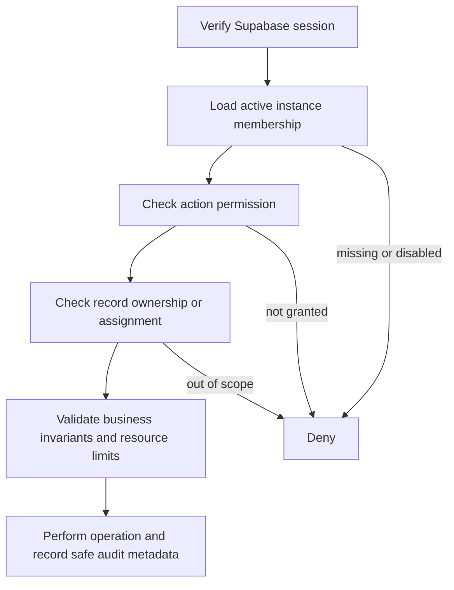

# Permissions and Access Model

Last reviewed: 2026-10-04

Status: current access inventory plus a **proposed, unimplemented** staff-role
model. The role matrix below is a starting point for the owner to review; it
does not assign anyone a role or change application access.

Dikho currently serves one trusted internal team. The public-release target is
one organization per isolated installation. Separate installations provide the
first organization boundary; staff within an installation still need explicit
permissions. See [Product direction](PRODUCT.md) and
[ADR 0005](decisions/0005-one-organization-per-instance.md).

## What the code enforces today

[API authentication](../src/api/middleware/requireAuth.js) resolves the bearer
token against Supabase Auth and stores the verified user ID and email. It does
not load membership, staff roles, record assignments or action permissions.
Consequently, a valid session generally grants access to all protected API
features listed below.

| Surface | Current access check | Remaining limitation |
| --- | --- | --- |
| Dashboard sign-in | Existing Supabase user; OTP requests use `shouldCreateUser: false` | No role assignment flow or role-based dashboard boundary |
| `/api/contacts` and `/api/contacts/import` | Valid session for reads, imports and deletion | No separate import or bulk-delete permission |
| `/api/campaigns` and its send/batch/retry endpoints | Valid session; send logic separately handles recipient claims and duplicates | No campaign-sender role or campaign-owner permission |
| `/api/templates`, `/api/cg-leads/whatsapp-status` | Valid session | No communications-role boundary |
| `/api/whatsapp/conversations/*` | Valid session for inbox, replies, read/typing signals and media/avatar writes | No conversation assignment or team/role restriction |
| `/api/whatsapp/reconcile` | Valid session | Not restricted to an operations administrator |
| `/api/whatsapp/media-ticket` | Valid session before issuing ticket | Any authenticated operator can obtain the same class of media access |
| `/api/whatsapp/media/:key` | Signed expiring ticket; no session required on the fetch itself | Ticket covers the media route, not a single user, conversation or object; default lifetime is six hours |
| `POST /api/avatars` | Valid session; object key comes from the caller's verified user ID | Public reading is intentional; upload validation needs the broader file-hardening work |
| `GET /api/avatars/:userId` | Public; UUID validation and fixed avatar prefix | Knowing a valid avatar URL allows reading it |
| `/api/public/vendor`, `/api/public/cg-lead` | Turnstile success, action and hostname, then server-only RPC | Verification protects form records, not the direct vendor-document upload |
| `/api/gstn/:gstin` | Public; input validation, rate limiting and configured daily budget | No session by design; some configuration/error conditions bypass the budget |
| Meta webhook | GET verification token; POST raw-body HMAC | Provider trust only, never general operator privileges |
| Supabase WhatsApp OTP hook | Standard Webhooks signature verification | Hook access is not a dashboard permission |
| Browser-to-Supabase business data | Effective PostgreSQL RLS and RPC grants | Several historical policies allow all authenticated users team-wide access |
| Browser-to-Supabase vendor documents | Effective Storage object policies | Known anonymous-upload and broad authenticated-access findings |
| `device-check` Edge Function | Verified user JWT; server writes scoped to that user | Optional security email does not introduce a staff role |

Sources: [route registration](../src/api/app.js),
[WhatsApp route registration](../src/api/routes/whatsapp/index.js),
[ticket implementation](../src/api/services/whatsapp/mediaTicket.js),
[avatar handlers](../src/api/routes/avatars/index.js),
[login](../src/features/auth/Login.jsx),
[device check](../supabase/functions/device-check/index.ts), and
[database/storage guide](DATABASE.md).

This is a source review, not confirmation of deployed RLS, grants, user
provisioning or provider settings. The [security audit](SECURITY-AUDIT.md)
continues to track these gaps.

## Proposed roles for review

A staff role is distinct from PostgreSQL's `anon`, `authenticated` and
`service_role` roles. Supabase's `authenticated` means signed in; it does not
mean administrator. Never expose the service-role key to an operator's browser.

| Proposed role | Intended responsibility |
| --- | --- |
| Administrator | User access, organization settings and integration administration |
| Finance | Invoicing, payments, allocations, reconciliation and financial reporting |
| Sales | Clients, leads, quotations/order preparation and customer follow-up |
| Operations | Vendors, procurement and delivery/execution records |
| Support | WhatsApp inbox, approved communication and contact maintenance |

Small teams may assign multiple roles to one person. An administrator should
not implicitly gain every business permission: for example, the owner may also
hold the finance role. The owner must confirm this separation and recovery
access before implementation.

## Draft permission matrix (not enforced)

`Allow` is a proposed permission for that role. `Read` is proposed read-only
access. `Scoped` requires an explicit record or team assignment that does not
exist yet. `Review` needs an owner decision before it can be granted. `—` means
deny by default in the proposed model. None of these labels describes an
implemented permission today.

| Action | Administrator | Finance | Sales | Operations | Support |
| --- | --- | --- | --- | --- | --- |
| Invite, disable or assign staff roles | Allow | — | — | — | — |
| Change branding and organization settings | Allow | — | — | — | — |
| Configure server integrations | Allow | — | — | — | — |
| Read clients and operational contact details | Review | Read | Scoped | Scoped | Scoped |
| Create/update clients and sales leads | — | — | Scoped | — | — |
| Prepare/edit sales-order drafts | — | Read | Scoped | Read | — |
| Approve sales commitments or discounts | Review | Review | Review | — | — |
| Maintain vendors and procurement drafts | — | Read | Read | Scoped | — |
| Approve vendors or purchase commitments | Review | Review | — | Review | — |
| Read vendor supporting documents | Review | Read | — | Scoped | — |
| Replace/delete vendor supporting documents | Review | — | — | Review | — |
| Create/issue invoices and record payments | — | Allow | Read | Read | — |
| Correct/void financial documents | Review | Review | — | — | — |
| View full financial reports and margins | Review | Allow | Review | Review | — |
| Read/reply to WhatsApp conversations | — | — | Review | Review | Scoped |
| Read conversation attachments | — | — | Review | Review | Scoped |
| Import or edit opted-in messaging contacts | — | — | Review | — | Review |
| Send/retry a bulk WhatsApp campaign | Review | — | Review | — | Review |
| Bulk-delete contacts or export personal data | Review | Review | Review | Review | Review |
| Run message-receipt reconciliation | Allow | — | — | — | — |
| Read security/access audit events | Allow | — | — | — | — |
| Update own profile/avatar; read own login events | Allow | Allow | Allow | Allow | Allow |

This matrix deliberately leaves financial approvals, mass sends, deletion and
exports undecided. Assigning a role must never skip consent/opt-out checks,
provider rules, idempotency, spend limits or financial invariants.

## Proposed enforcement design

This flow is a target design. Membership storage, permission middleware,
assignment fields and audit coverage are implementation work, not existing
features.

1. Store trusted membership/role assignments in a server-controlled table or
   equivalent authority. Do not authorize using user-editable profile metadata,
   request fields, local storage or hidden UI controls.
2. Check permissions in the API for every D1/R2 action. Client route guards only
   help navigation and explain denial.
3. Enforce equivalent access in PostgreSQL RLS and security-definer RPCs, since
   browser clients call Supabase directly. Enforce document access in Storage
   policies or a narrow authorized server path.
4. Scope media tickets to an authorized object or conversation and bound their
   lifetime. Session or role revocation must have a documented effect on
   already-issued tickets and caches.
5. Keep public intake and provider hooks separate from staff permissions. A
   valid Turnstile or webhook signature must not grant dashboard access.
6. Deny missing/disabled membership and unknown permissions. Decide how role
   changes invalidate cached permission data before introducing caching.
7. Audit role changes and sensitive business operations using identifiers and
   outcomes, without credentials, signed URLs, message bodies or documents.

## Decisions needed before implementation

- Which roles does the actual team need, and may one user hold multiple roles?
- Should sales/support access cover all organization records or assigned records?
- Who may approve vendors, discounts, purchasing, invoice corrections and sends?
- Which actions require a second person, and what is the emergency recovery path?
- Who may export personal data, see margins or delete documents/contacts?
- Who owns the first administrator account and access reviews for each instance?

Record the accepted model in an ADR and update this matrix before adding policy
migrations. Do not infer answers from today's broad access.

## Verification required when roles are implemented

Test every action for allowed, denied, missing-session, disabled-membership and
wrong-record cases. Call the API and Supabase directly as well as through the UI.
Attempt to change role fields from a normal session; this must not elevate
privileges. Verify public/provider routes cannot reach staff-only actions, and
test role removal against active sessions and outstanding media tickets.

Use local/staging identities and synthetic records. Applied policy changes need
allow-and-deny checks under the real database roles. See [Testing](TESTING.md)
and [Deployment](DEPLOYMENT.md); this document itself performs no migration.
